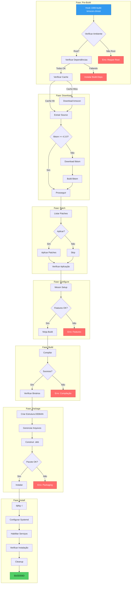
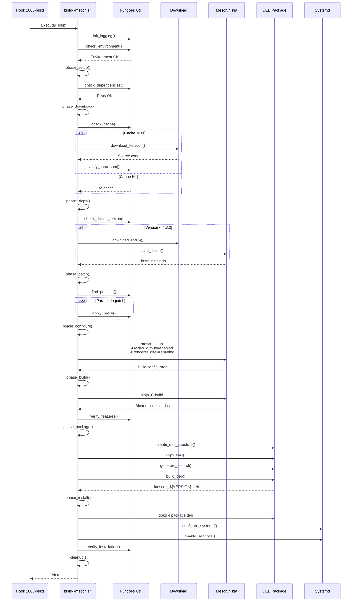

# 📐 ESPECIFICAÇÃO TÉCNICA: Script de Build do KMSCON

## 1. Diagrama de Fluxo do Build



---

## 2. Diagrama de Sequência das Fases



---

## 3. Estrutura das Funções Principais

### 3.1 Funções de Inicialização e Logging

```bash
# ============================================
# FUNÇÕES DE INICIALIZAÇÃO
# ============================================

init_logging()
├── Define LOG_LEVEL (DEBUG/INFO/WARN/ERROR)
├── Define LOG_FILE
├── Cria diretório de log se necessário
└── Retorna: void

check_environment()
├── Verifica se está rodando como root
├── Verifica versão do Bash (>= 4.0)
├── Verifica se está em ambiente chroot
└── Retorna: 0|1

check_dependencies()
├── Verifica meson
├── Verifica ninja
├── Verifica gcc/clang
├── Verifica todas as dependências de build
└── Retorna: 0|1 + lista de faltantes
```

### 3.2 Funções de Download e Cache

```bash
check_cache()
├── Verifica existência do arquivo em CACHE_DIR
├── Verifica checksum se CHECKSUM_VERIFY=1
└── Retorna: 0 (cache hit) | 1 (cache miss)

download_kmscon()
├── Determina versão a baixar (KMSCON_VERSION)
├── Baixa do GitHub releases ou git clone
├── Salva em CACHE_DIR
├── Calcula checksum
└── Retorna: 0|1
download_libtsm()
├── Similar a download_kmscon
└── Retorna: 0|1
```

### 3.3 Funções de Build

```bash
check_libtsm_version()
├── pkg-config --modversion libtsm
├── Compara com versão mínima (4.3.0)
└── Retorna: 0 (OK) | 1 (versão insuficiente)

build_libtsm()
├── Extrai source
├── meson setup
├── ninja build
├── ninja install
└── Retorna: 0|1

apply_patches()
├── Lista arquivos em PATCHES_DIR (*.diff *.patch)
├── Para cada patch:
│   ├── Tenta aplicar com patch -p1
│   ├── Registra sucesso/falha
│   └── Continua mesmo se um falhar (opcional)
└── Retorna: count de patches aplicados
```

### 3.4 Funções de Configuração

```bash
configure_meson()
├── meson setup build/ \
│   -Dvideo_drm3d=enabled \
│   -Drenderer_gltex=enabled \
│   -Dfont_pango=enabled \
│   -Dlibinput=enabled \
│   -Dmulti_seat=enabled \
│   -Dsession_terminal=enabled \
│   --prefix=/usr \
│   --buildtype=release
└── Retorna: 0|1

verify_features()
├── Analisa meson-logs/build-info.json
├── Verifica se cada feature foi habilitada
└── Retorna: 0 (todas OK) | 1 (faltando)
```

### 3.5 Funções de Empacotamento

```bash
create_deb_structure()
├── Cria DEBIAN/ em package_root
├── Cria subdirs: usr/bin, usr/lib, etc/kmscon
├── Copia binários compilados
└── Retorna: 0|1

generate_control()
├── Gera DEBIAN/control com:
│   ├── Package: kmscon
│   ├── Version: ${VERSION}
│   ├── Architecture: $(dpkg --print-architecture)
│   ├── Depends: (runtime deps)
│   ├── Maintainer: AURORA NAS
│   └── Description: KMS/DRM based system console
└── Retorna: 0|1

build_deb()
├── dpkg-deb --build package_root
├── Move .deb para output dir
└── Retorna: 0|1
```

### 3.6 Funções de Instalação e Integração

```bash
install_package()
├── dpkg -i kmscon_${VERSION}.deb
├── Trata dependências faltantes com apt-get -f install
└── Retorna: 0|1

configure_systemd()
├── Cria kmscon-getty@.service
├── Desabilita getty@.service nos TTYs configurados
├── Habilita kmscon nos TTYs configurados
└── Retorna: 0|1

verify_installation()
├── Verifica kmscon --version
├── Verifica serviços systemd ativos
└── Retorna: 0|1
```

---

## 4. Definição das Dependências

### 4.1 Dependências de Build

| Pacote             | Versão   | Motivo                    |
| ------------------ | -------- | ------------------------- |
| build-essential    | latest   | Compilação C              |
| meson              | >= 0.55  | Build system              |
| ninja-build        | latest   | Build executor            |
| pkg-config         | latest   | Detecção de libs          |
| libdrm-dev         | latest   | DRM support               |
| libxkbcommon-dev   | latest   | Keyboard handling         |
| libtsm-dev         | >= 4.3.0 | Terminal emulation        |
| libudev-dev        | latest   | Device management         |
| libsystemd-dev     | latest   | systemd integration       |
| libpango1.0-dev    | latest   | Font rendering            |
| libfontconfig1-dev | latest   | Font configuration        |
| libfreetype-dev    | latest   | Font rendering            |
| libgbm-dev         | latest   | Generic buffer management |
| libegl1-mesa-dev   | latest   | EGL support               |
| libgles2-mesa-dev  | latest   | GLES support              |
| libinput-dev       | latest   | Input handling            |

### 4.2 Dependências de Runtime

| Pacote         | Motivo                    |
| -------------- | ------------------------- |
| libdrm2        | DRM support               |
| libxkbcommon0  | Keyboard handling         |
| libtsm0        | Terminal emulation        |
| libudev1       | Device management         |
| libsystemd0    | systemd integration       |
| libpango-1.0-0 | Font rendering            |
| libfontconfig1 | Font configuration        |
| libfreetype6   | Font rendering            |
| libgbm1        | Generic buffer management |
| libegl1        | EGL support               |
| libgles2       | GLES support              |
| libinput10     | Input handling            |
| xkb-data       | Keyboard layouts          |

### 4.3 Ordem de Build

```
1. Instalar dependências de build
2. Verificar/liberar libtsm >= 4.3.0
   └─ Se necessário: build libtsm primeiro
3. Download kmscon source
4. Aplicar patches
5. Configurar meson
6. Build com ninja
7. Criar pacote .deb
8. Instalar pacote
9. Configurar systemd
```

---

## 5. Estratégia de Patches

### 5.1 Detecção Automática de Patches

```bash
PATCHES_DIR="${SCRIPT_DIR}/patches"
apply_patches() {
    local patches=("${PATCHES_DIR}"/*.diff "${PATCHES_DIR}"/*.patch)
    for patch in "${patches[@]}"; do
        [[ -f "$patch" ]] || continue
        log_info "Aplicando patch: ${patch##*/}"
        if patch -p1 --dry-run < "$patch" &>/dev/null; then
            patch -p1 < "$patch"
        else
            log_warn "Patch falhou (pode já estar aplicado): ${patch##*/}"
        fi
    done
}
```

### 5.2 Patches Esperados para Debian 13

| Patch                        | Descrição                         | Condição       |
| ---------------------------- | --------------------------------- | -------------- |
| 01-fix-meson-deprecated.diff | Corrige opções meson deprecadas   | Meson >= 0.60  |
| 02-debian-paths.diff         | Ajusta paths para Debian FHS      | Sempre         |
| 03-systemd-service.diff      | Adiciona service file customizado | Sempre         |
| 04-libtsm-version-check.diff | Ajusta versão mínima libtsm       | libtsm < 4.3.0 |

---

## 6. Estrutura de Diretórios do Build

```
/tmp/kmscon-build/                    # BUILD_ROOT (temporário)
├── src/                               # Source code
│   ├── kmscon-${VERSION}/
│   │   ├── meson.build
│   │   ├── src/
│   │   └── ...
│   └── libtsm-${VERSION}/             # Se necessário
│       ├── meson.build
│       └── ...
├── build/                             # Build directory
│   └── kmscon/
│       ├── build.ninja
│       ├── meson-info/
│       └── ...
└── package/                           # DEB package structure
    └── kmscon-${VERSION}/
        ├── DEBIAN/
        │   ├── control
        │   ├── postinst
        │   ├── prerm
        │   └── conffiles
        ├── etc/
        │   ├── kmscon/
        │   │   └── kmscon.conf
        │   └── systemd/
        │       └── system/
        │           └── kmscon-getty@.service
        └── usr/
            ├── bin/
            │   └── kmscon
            └── share/
                ├── doc/
                │   └── kmscon/
                │       └── copyright
                └── kmscon/
                    └── ...
```

---

## 7. Integração systemd

### 7.1 Serviço kmscon-getty@.service

```ini
[Unit]
Description=KMS/DRM based system console on %I
Documentation=man:kmscon(1)
After=systemd-user-sessions.service
Before=getty.target
IgnoreOnIsolate=yes
ConditionPathExists=/dev/tty0

[Service]
Type=simple
Environment=HOME=/root
WorkingDirectory=/root
ExecStart=/usr/bin/kmscon --vt=%I --seats=seat0 --no-switchvt --login -- /bin/login -p
StandardInput=tty
StandardOutput=tty
TTYPath=/dev/%I
TTYReset=yes
TTYVHangup=yes
KillMode=process
IgnoreSIGPIPE=no
SendSIGHUP=yes

[Install]
WantedBy=getty.target
```

### 7.2 Hook de Ativação

```bash
enable_kmscon_vts() {
    local vts=("${KMSCON_VTS:-tty1 tty2}")
    for vt in "${vts[@]}"; do
        # Desabilita getty neste TTY
        systemctl disable "getty@${vt}.service" 2>/dev/null || true
        # Habilita kmscon
        systemctl enable "kmscon-getty@${vt}.service"
    done
}
```

---

## 8. Configuração kmscon.conf

```ini
# /etc/kmscon/kmscon.conf
# Configuração otimizada para AURORA NAS

[config]
# Terminal de 256 cores
palette=linux

# Fonte
font-name=Monospace
font-size=16

# Scrollback
scrollback-size=10000

# Performance
gpu-acceleration=enabled
render-engine=gltex

# Input
grab-keyboard=true
grab-mouse=false

# Layout de teclado (Brasil)
xkb-layout=br
xkb-variant=abnt2

# Cursor
cursor-blink=true
```

---

## 9. Plano de Rollback e Fallback

### 9.1 Rollback Automático

```bash
rollback_installation() {
    log_warn "Executando rollback..."
    # Remove serviços
    systemctl disable kmscon-getty@tty1.service 2>/dev/null || true
    systemctl disable kmscon-getty@tty2.service 2>/dev/null || true
    # Reabilita getty
    systemctl enable getty@tty1.service 2>/dev/null || true
    systemctl enable getty@tty2.service 2>/dev/null || true
    # Remove pacote se instalado
    dpkg -r kmscon 2>/dev/null || true
    log_info "Rollback concluído"
}
```

### 9.2 Fallback para getty

```bash
# No postinst: se kmscon falhar em inicializar,
# getty continua rodando em TTY3+
mkdir -p /etc/systemd/system/getty@tty3.service.d/
cat > /etc/systemd/system/getty@tty3.service.d/fallback.conf << 'EOF'
[Unit]
Description=Fallback getty for kmscon recovery
ConditionPathExists=!/run/kmscon.active
EOF
```

---

## 10. Variáveis de Configuração

```bash
# ============================================
# VARIÁVEIS CONFIGURÁVEIS
# ============================================

# Versões
readonly KMSCON_VERSION="${KMSCON_VERSION:-9.0.0}"
readonly LIBTSM_VERSION="${LIBTSM_VERSION:-4.3.0}"

# URLs
readonly KMSCON_URL="${KMSCON_URL:-https://github.com/kmscon/kmscon/releases/download/v${KMSCON_VERSION}/kmscon-${KMSCON_VERSION}.tar.xz}"
readonly LIBTSM_URL="${LIBTSM_URL:-https://github.com/kmscon/libtsm/releases/download/v${LIBTSM_VERSION}/libtsm-${LIBTSM_VERSION}.tar.xz}"

# Diretórios
readonly BUILD_ROOT="${BUILD_ROOT:-/tmp/kmscon-build}"
readonly CACHE_DIR="${CACHE_DIR:-${SCRIPT_DIR}/cache}"
readonly PATCHES_DIR="${PATCHES_DIR:-${SCRIPT_DIR}/patches}"
readonly OUTPUT_DIR="${OUTPUT_DIR:-/var/cache/kmscon-build}"

# Opções
readonly PARALLEL_JOBS="${PARALLEL_JOBS:-$(nproc)}"
readonly CHECKSUM_VERIFY="${CHECKSUM_VERIFY:-1}"
readonly KEEP_BUILD="${KEEP_BUILD:-0}"

# Logging
readonly LOG_LEVEL="${LOG_LEVEL:-INFO}"
readonly LOG_FILE="${LOG_FILE:-/var/log/kmscon-build.log}"

# Systemd
readonly KMSCON_VTS="${KMSCON_VTS:-tty1 tty2}"
readonly KMSCON_SEATS="${KMSCON_SEATS:-seat0}"
```

---

## 11. Códigos de Saída

| Código | Significado                        |
| ------ | ---------------------------------- |
| 0      | Sucesso                            |
| 1      | Erro genérico                      |
| 10     | Não está rodando como root         |
| 11     | Bash version < 4.0                 |
| 12     | Dependências faltando              |
| 20     | Download falhou                    |
| 21     | Checksum inválido                  |
| 30     | Patch falhou                       |
| 40     | Configuração meson falhou          |
| 41     | Feature obrigatória não habilitada |
| 50     | Build falhou                       |
| 60     | Empacotamento falhou               |
| 70     | Instalação falhou                  |
| 71     | Configuração systemd falhou        |

---

_Documento gerado para especificação técnica do build do KMSCON_
