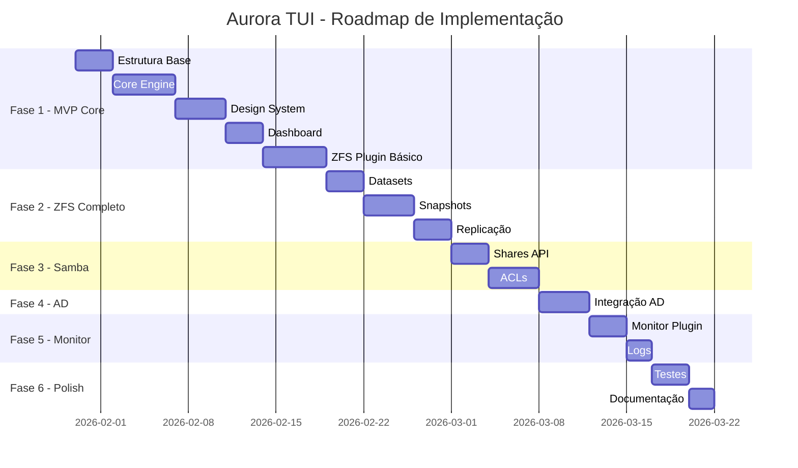

# Plano de Implementação - Aurora TUI

## Visão Geral

Este documento detalha o plano de implementação incremental da Aurora TUI, dividido em fases lógicas que permitem entregas contínuas de valor.

## Roadmap



---

## Fase 1: MVP Core (Estimado: 20 dias)

### Semana 1-2: Fundação

#### 1.1 Estrutura Base do Projeto
**Arquivos:**
- `go.mod` - Dependências
- `Makefile` - Build, test, lint
- `.golangci.yml` - Configuração do linter
- `.gitignore`

**Dependências:**
```go
require (
    github.com/charmbracelet/bubbletea v0.25.0
    github.com/charmbracelet/lipgloss v0.9.1
    github.com/charmbracelet/bubbles v0.18.0
    github.com/mattn/go-sqlite3 v1.14.19
    github.com/spf13/viper v1.18.2
    go.uber.org/zap v1.26.0
)
```

**Entregável:** Projeto compilável com estrutura de diretórios completa

---

#### 1.2 Core Engine

##### 1.2.1 App (`internal/core/app.go`)
```go
type App struct {
    config   *ConfigManager
    router   *Router
    executor *CommandExecutor
    audit    *AuditLogger
    plugins  *PluginManager
    state    *StateStore
    ui       *UIManager
}

func (a *App) Run() error
func (a *App) RegisterPlugin(p Plugin) error
func (a *App) Shutdown() error
```

##### 1.2.2 Router (`internal/core/router.go`)
```go
type Router struct {
    routes       map[string]Route
    history      []RouteInfo
    currentView  tea.Model
    middlewares  []Middleware
}

func (r *Router) Register(path string, view View) Route
func (r *Router) Navigate(path string) error
func (r *Router) Back() error
func (r *Router) Update(msg tea.Msg) (tea.Model, tea.Cmd)
func (r *Router) View() string
```

##### 1.2.3 ConfigManager (`internal/core/config.go`)
```go
type ConfigManager struct {
    db     *sql.DB
    cache  map[string]interface{}
    mu     sync.RWMutex
}

func (c *ConfigManager) Init(dbPath string) error
func (c *ConfigManager) Get(key string) (string, error)
func (c *ConfigManager) Set(key string, value interface{}) error
func (c *ConfigManager) PluginConfig(name string) PluginConfig
func (c *ConfigManager) Close() error
```

**Schema SQLite:**
```sql
CREATE TABLE config (
    key TEXT PRIMARY KEY,
    value TEXT,
    updated_at TIMESTAMP DEFAULT CURRENT_TIMESTAMP
);

CREATE TABLE plugin_config (
    plugin TEXT,
    key TEXT,
    value TEXT,
    PRIMARY KEY (plugin, key)
);

CREATE TABLE audit_log (
    id INTEGER PRIMARY KEY AUTOINCREMENT,
    timestamp TIMESTAMP DEFAULT CURRENT_TIMESTAMP,
    user TEXT,
    action TEXT,
    resource TEXT,
    details TEXT,
    status TEXT
);
```

##### 1.2.4 CommandExecutor (`internal/core/executor.go`)
```go
type CommandExecutor struct {
    dryRun      bool
    audit       *AuditLogger
    validators  map[string]Validator
}

func (e *CommandExecutor) Execute(ctx context.Context, cmd Command) (Result, error)
func (e *CommandExecutor) ExecuteBatch(ctx context.Context, cmds []Command) ([]Result, error)
func (e *CommandExecutor) SetDryRun(enabled bool)
```

##### 1.2.5 AuditLogger (`internal/core/audit.go`)
```go
type AuditLogger struct {
    db     *sql.DB
    logger *zap.Logger
}

func (a *AuditLogger) Log(entry AuditEntry) error
func (a *AuditLogger) Query(filter AuditFilter) ([]AuditEntry, error)
```

---

#### 1.3 Design System

##### 1.3.1 Tema (`internal/ui/theme.go`)
```go
package ui

import "github.com/charmbracelet/lipgloss"

var (
    // Cores AURORA
    Void      = lipgloss.Color("#262626")
    Depth     = lipgloss.Color("#3a3a3a")
    // ... todas as cores
)

var Theme = struct {
    Header lipgloss.Style
    Section lipgloss.Style
    Card lipgloss.Style
    // ... outros estilos
}{
    Header: lipgloss.NewStyle().
        BorderStyle(lipgloss.DoubleBorder()).
        BorderForeground(Slate).
        Foreground(Peak).
        Bold(true).
        Padding(1, 2).
        Width(60).
        Align(lipgloss.Center),
    // ...
}
```

##### 1.3.2 Componentes Base

**Header (`internal/ui/components/header.go`):**
```go
type Header struct {
    Title    string
    Subtitle string
}

func (h Header) Render() string
```

**List (`internal/ui/components/list.go`):**
```go
type List struct {
    Items      []ListItem
    Selected   int
    OnSelect   func(index int)
    OnConfirm  func(index int)
}

func (l *List) Update(msg tea.Msg) (tea.Model, tea.Cmd)
func (l *List) View() string
```

**Table (`internal/ui/components/table.go`):**
```go
type Table struct {
    Columns    []Column
    Rows       []Row
    Selected   int
    SortColumn int
    SortDesc   bool
}

type Column struct {
    Title string
    Width int
    Key   string
}
```

**Form (`internal/ui/components/form.go`):**
```go
type Form struct {
    Fields     []Field
    OnSubmit   func(values map[string]string)
    OnCancel   func()
}

type Field struct {
    Key         string
    Label       string
    Type        string // text, password, select, checkbox
    Value       string
    Placeholder string
    Required    bool
    Validate    func(string) error
}
```

##### 1.3.3 Componentes de Feedback

**Modal (`internal/ui/components/modal.go`):**
```go
type Modal struct {
    Title     string
    Content   string
    Type      ModalType // info, success, warning, error
    Actions   []Action
    Width     int
    Height    int
}
```

**Progress (`internal/ui/components/progress.go`):**
```go
type Progress struct {
    Current   int
    Total     int
    Label     string
    Width     int
}

func (p Progress) Render() string
```

**Spinner (`internal/ui/components/spinner.go`):**
```go
type Spinner struct {
    spinner.Model
    Title string
}
```

---

#### 1.4 Dashboard

##### 1.4.1 View Principal (`internal/ui/views/dashboard.go`)
```go
type DashboardView struct {
    width      int
    height     int
    cpuWidget  *CPUWidget
    memWidget  *MemoryWidget
    poolWidget *PoolWidget
    services   *ServiceWidget
    menu       *MenuWidget
    help       *HelpWidget
}

func (d *DashboardView) Init() tea.Cmd
func (d *DashboardView) Update(msg tea.Msg) (tea.Model, tea.Cmd)
func (d *DashboardView) View() string
```

**Layout:**
```
┌─────────────────────────────────────────────────────────────────┐
│  HEADER                                                         │
├─────────────────────────────────────────────────────────────────┤
│  ┌────────┐ ┌────────┐ ┌────────┐                              │
│  │  CPU   │ │  MEM   │ │  ARC   │                              │
│  └────────┘ └────────┘ └────────┘                              │
│  ┌─────────────────────────────────────────────────────────┐   │
│  │  POOLS                                                  │   │
│  └─────────────────────────────────────────────────────────┘   │
│  ┌─────────────────────┐ ┌─────────────────────────────────┐   │
│  │  SERVIÇOS           │ │  MENU                           │   │
│  └─────────────────────┘ └─────────────────────────────────┘   │
│  [F1 Ajuda] [F2 Dash] [F3 Pools] [F4 Shares] [Q Sair]          │
└─────────────────────────────────────────────────────────────────┘
```

---

#### 1.5 ZFS Plugin (Básico)

##### 1.5.1 API (`internal/plugins/zfs/api.go`)
```go
type ZFSAPI struct {
    executor *core.CommandExecutor
}

func (z *ZFSAPI) ListPools() ([]Pool, error)
func (z *ZFSAPI) GetPool(name string) (*Pool, error)
func (z *ZFSAPI) CreatePool(opts CreatePoolOptions) error
func (z *ZFSAPI) DestroyPool(name string, force bool) error
func (z *ZFSAPI) ListDatasets(pool string) ([]Dataset, error)
```

##### 1.5.2 Views

**PoolsView (`internal/plugins/zfs/pools_view.go`):**
```go
type PoolsView struct {
    table    *components.Table
    api      *ZFSAPI
    selected *Pool
}

func (p *PoolsView) Init() tea.Cmd
func (p *PoolsView) Update(msg tea.Msg) (tea.Model, tea.Cmd)
func (p *PoolsView) View() string
```

**PoolDetailView (`internal/plugins/zfs/pool_detail_view.go`):**
```go
type PoolDetailView struct {
    poolName string
    pool     *Pool
    api      *ZFSAPI
}
```

**CreatePoolWizard (`internal/plugins/zfs/create_pool_wizard.go`):**
```go
type CreatePoolWizard struct {
    step      int
    form      *components.Form
    disks     []Disk
    selected  []string
    config    CreatePoolOptions
}

const (
    StepSelectDisks = iota
    StepRAIDConfig
    StepOptions
    StepConfirm
)
```

---

## Fase 2: ZFS Completo (Estimado: 10 dias)

### 2.1 Datasets

```go
func (z *ZFSAPI) CreateDataset(opts CreateDatasetOptions) error
func (z *ZFSAPI) DestroyDataset(name string, recursive bool) error
func (z *ZFSAPI) SetProperty(dataset, property, value string) error
func (z *ZFSAPI) GetProperty(dataset, property string) (string, error)
```

**Views:**
- DatasetsView
- DatasetDetailView
- CreateDatasetWizard
- EditPropertiesDialog

### 2.2 Snapshots

```go
func (z *ZFSAPI) CreateSnapshot(dataset, name string, recursive bool) error
func (z *ZFSAPI) ListSnapshots(dataset string) ([]Snapshot, error)
func (z *ZFSAPI) RollbackSnapshot(name string) error
func (z *ZFSAPI) DestroySnapshot(name string) error
func (z *ZFSAPI) SendSnapshot(name string, w io.Writer) error
func (z *ZFSAPI) ReceiveSnapshot(dataset string, r io.Reader) error
```

**Views:**
- SnapshotsView
- CreateSnapshotDialog
- RollbackConfirmDialog

### 2.3 Replicação

```go
func (z *ZFSAPI) SendIncremental(from, to string, w io.Writer) error
func (z *ZFSAPI) SetupReplication(opts ReplicationConfig) error
```

---

## Fase 3: Samba (Estimado: 7 dias)

### 3.1 API

```go
type SambaAPI struct {
    configPath string
}

func (s *SambaAPI) ListShares() ([]Share, error)
func (s *SambaAPI) GetShare(name string) (*Share, error)
func (s *SambaAPI) CreateShare(share Share) error
func (s *SambaAPI) UpdateShare(share Share) error
func (s *SambaAPI) DeleteShare(name string) error
func (s *SambaAPI) TestConfig() error
func (s *SambaAPI) Reload() error
```

### 3.2 ACLs

```go
func (s *SambaAPI) GetACLs(path string) ([]ACL, error)
func (s *SambaAPI) SetACL(path string, acl ACL) error
func (s *SambaAPI) RemoveACL(path string, entry ACLEntry) error
```

---

## Fase 4: Active Directory (Estimado: 7 dias)

```go
type ADAPI struct{}

func (a *ADAPI) DiscoverDomain(domain string) (*DomainInfo, error)
func (a *ADAPI) JoinDomain(realm, user, password string) error
func (a *ADAPI) LeaveDomain() error
func (a *ADAPI) GetDomainInfo() (*DomainInfo, error)
func (a *ADAPI) ListDomainUsers() ([]User, error)
func (a *ADAPI) ListDomainGroups() ([]Group, error)
```

---

## Fase 5: Monitoramento (Estimado: 5 dias)

```go
type MonitorAPI struct{}

func (m *MonitorAPI) GetSystemMetrics() (*SystemMetrics, error)
func (m *MonitorAPI) GetZFStats() (*ZFStats, error)
func (m *MonitorAPI) GetServices() ([]Service, error)
func (m *MonitorAPI) GetLogs(opts LogOptions) ([]LogEntry, error)
func (m *MonitorAPI) SubscribeAlerts(handler AlertHandler) Subscription
```

---

## Fase 6: Polish (Estimado: 5 dias)

### 6.1 Testes
- Unit tests (>80% coverage)
- Integration tests
- Mock para ZFS/AD

### 6.2 Documentação
- User guide
- Admin guide
- API reference
- Troubleshooting

### 6.3 Otimizações
- Cache de métricas
- Batching de comandos
- Redução de renderizações

---

## Checklist de Qualidade

### Código
- [ ] Linting com golangci-lint
- [ ] Formatação gofmt
- [ ] Testes unitários
- [ ] Testes de integração
- [ ] Documentação de funções públicas

### UI/UX
- [ ] Navegação por teclado completa
- [ ] Contraste adequado (WCAG)
- [ ] Mensagens de erro claras
- [ ] Feedback de operações
- [ ] Confirmações para ações destrutivas

### Performance
- [ ] Operações assíncronas
- [ ] Cache quando apropriado
- [ ] Otimização para SSH

### Segurança
- [ ] Auditoria de operações
- [ ] Validação de inputs
- [ ] Sanitização de comandos
- [ ] Proteção contra race conditions

---

## Convenções de Código

### Estrutura de Arquivos
```
internal/
  package/
    file.go              # Código principal
    file_test.go         # Testes
    types.go             # Tipos compartilhados
    errors.go            # Erros customizados
```

### Nomenclatura
- Tipos exportados: `PascalCase`
- Funções exportadas: `PascalCase`
- Variáveis/funções privadas: `camelCase`
- Constantes: `SCREAMING_SNAKE_CASE`
- Interfaces: terminam em `-er` (ex: `Reader`, `Writer`)

### Padrões
- Retorne erros como último valor
- Use `context.Context` para operações de longa duração
- Prefira composição a herança
- Documente funções públicas

---

## Entregáveis por Fase

| Fase | Entregável | Critério de Aceitação |
|------|------------|----------------------|
| 1.1 | Projeto base | Compila sem erros, tests passam |
| 1.2 | Core Engine | Plugins podem ser registrados e inicializados |
| 1.3 | Design System | Todos os componentes renderizam corretamente |
| 1.4 | Dashboard | Mostra métricas em tempo real |
| 1.5 | ZFS Básico | Listar pools, criar pool via wizard |
| 2.1 | Datasets | CRUD completo de datasets |
| 2.2 | Snapshots | Criar, listar, rollback de snapshots |
| 2.3 | Replicação | Send/receive funcional |
| 3.1 | Shares | CRUD completo de compartilhamentos SMB |
| 3.2 | ACLs | Gerenciamento de permissões |
| 4.1 | AD | Join/leave domain funcional |
| 5.1 | Monitor | Dashboard de recursos e logs |
| 6.1 | Release | Documentação completa, testes >80% |

---

**Versão:** 1.0.0  
**Última Atualização:** 2026-01-30  
**Status:** Aguardando início da Fase 1
