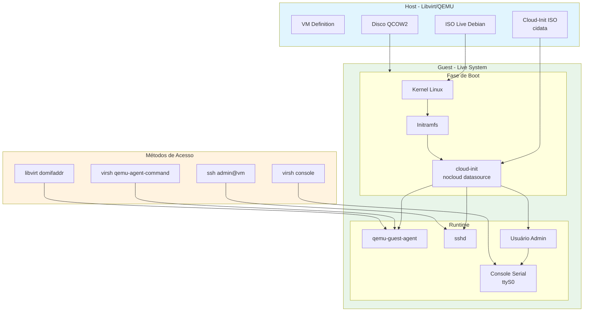
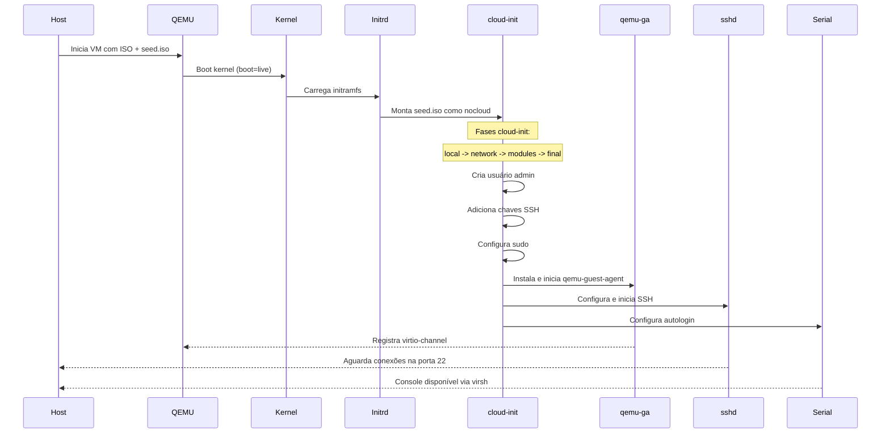
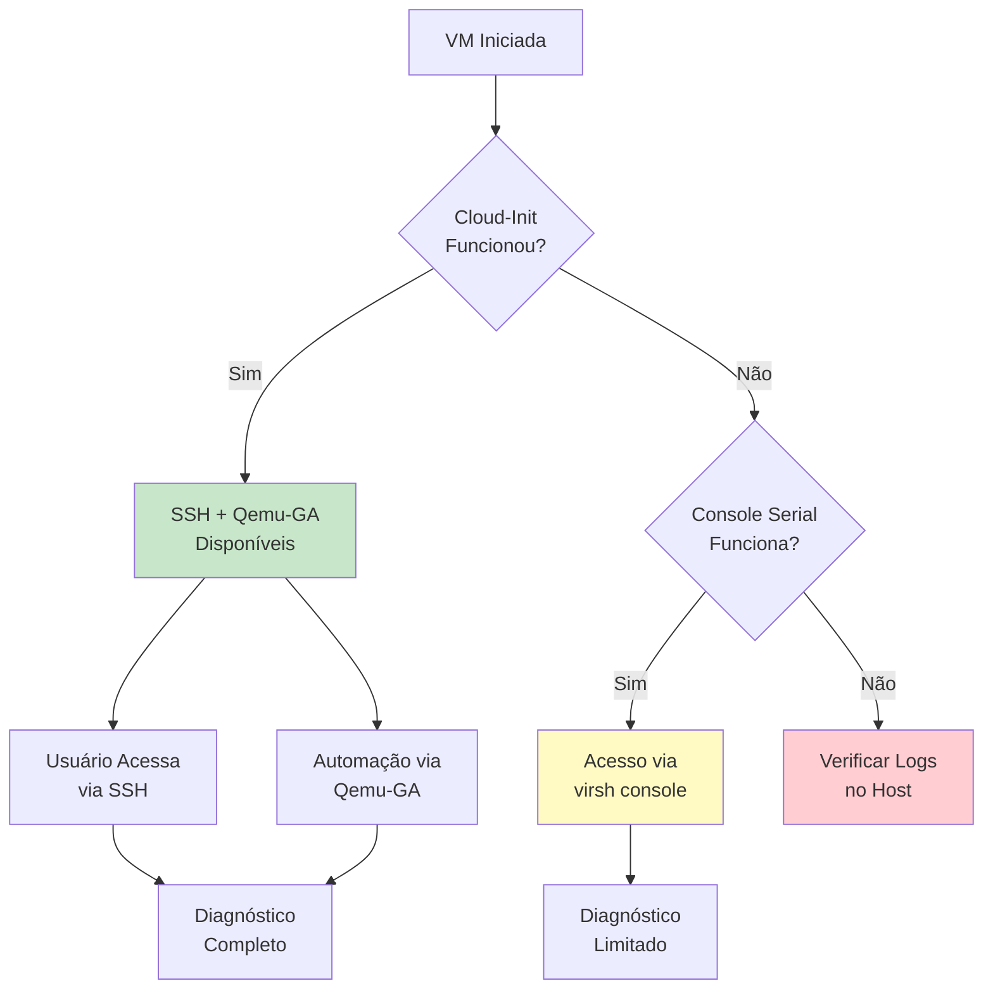

# Arquitetura de Acesso à VM com Cloud-Init e Qemu-Guest-Agent

## Aurora NAS - Debian ZFS Live ISO

**Versão:** 1.0  
**Data:** 2026-02-01  
**Status:** Especificação Técnica Completa

---

## 1. Visão Geral da Arquitetura

### 1.1 Objetivo

Projetar uma solução robusta e em camadas para acesso à VM que permita:

- Validação automatizada da imagem live
- Depuração de erros em tempo real
- Acesso remoto via SSH com autenticação por chave
- Comunicação bidirecional host-guest via qemu-guest-agent
- Fallback confiável para console serial

### 1.2 Princípios de Design

1. **Camadas de Resiliência:** Múltiplos métodos de acesso com fallback automático
2. **Automação Zero-Touch:** Configuração automática sem intervenção manual
3. **Segurança:** Chaves SSH ao invés de senhas, comunicação criptografada
4. **Observabilidade:** Métricas e logs para diagnóstico
5. **Compatibilidade:** Funciona em modo usuário (qemu:///session)

---

## 2. Diagrama de Arquitetura



---

## 3. Fluxo de Inicialização



---

## 4. Estratégia de Datasource: NoCloud

### 4.1 Por que NoCloud?

Em VMs locais com libvirt/qemu em modo usuário, não há datasource tradicional de cloud (AWS, Azure, GCP). O datasource `nocloud` é a solução ideal porque:

- Funciona localmente sem infraestrutura de cloud
- Suporta CD-ROM, imagem floppy ou diretório local
- Totalmente offline
- Compatível com live systems

### 4.2 Estrutura do Datasource

```
seed.iso (label: cidata)
├── user-data      # Configuração principal (YAML)
├── meta-data      # Identificação da instância
└── network-config # Configuração de rede (opcional)
```

### 4.3 Kernel Command Line

```bash
# Parâmetro para ativar nocloud com CD-ROM
ds=nocloud;s=/cdrom/nocloud/

# Ou para caminho específico
ds=nocloud-seed;s=file:///var/lib/cloud/seed/nocloud
```

---

## 5. Configuração Cloud-Init

### 5.1 user-data

```yaml
#cloud-config
# =============================================================================
# Aurora NAS - Cloud-Init Configuration
# =============================================================================

# Identificação
hostname: debian-zfs-live
fqdn: debian-zfs-live.local

# Configuração de usuário
users:
  - name: admin
    gecos: Aurora NAS Administrator
    sudo: ALL=(ALL) NOPASSWD:ALL
    shell: /bin/bash
    # Senha criptografada: 'admin'
    passwd: "$6$rounds=4096$saltsalt$LKJlkjasdf..."
    # Chaves SSH públicas (injetadas dinamicamente)
    ssh_authorized_keys:
      - ssh-rsa AAAAB3NzaC1... user@host
      - ssh-ed25519 AAAAC3NzaC1... user@host
    lock_passwd: false

# Configuração SSH
ssh:
  pwauth: true # Permitir senha (fallback)
  authorized_keys: [] # Será preenchido acima

# Configurações de autenticação
chpasswd:
  list: |
    admin:admin
  expire: false

# Pacotes adicionais
packages:
  - qemu-guest-agent
  - openssh-server
  - curl
  - jq

# Serviços para habilitar
runcmd:
  # Configura qemu-guest-agent
  - |
    systemctl enable qemu-guest-agent || true
    systemctl start qemu-guest-agent || true

  # Ajusta permissões SSH
  - |
    mkdir -p /home/admin/.ssh
    chmod 700 /home/admin/.ssh
    chown -R admin:admin /home/admin/.ssh

  # Banner de login informativo
  - |
    cat > /etc/update-motd.d/99-aurora << 'EOF'
    #!/bin/bash
    echo "======================================"
    echo "  Aurora NAS - Debian ZFS Live"
    echo "======================================"
    echo "  Acesso: ssh admin@<ip>"
    echo "  Console: virsh console debian-zfs-lab"
    echo "======================================"
    EOF
    chmod +x /etc/update-motd.d/99-aurora

# Configuração de rede (básica - DHCP)
network:
  version: 2
  ethernets:
    eth0:
      dhcp4: true
      dhcp6: false

# Fase de inicialização
cloud_init_modules:
  - migrator
  - seed_random
  - bootcmd
  - write_files
  - growpart
  - resizefs
  - set_hostname
  - update_hostname
  - update_etc_hosts
  - ca_certs
  - rsyslog
  - users_groups
  - ssh

cloud_config_modules:
  - mounts
  - locale
  - set_passwords
  - yum_add_repo
  - apt_configure
  - ntp
  - timezone
  - disable_ec2_metadata
  - runcmd

cloud_final_modules:
  - package_update_upgrade_install
  - fans
  - puppet
  - chef
  - salt_minion
  - mcollective
  - rightscale_userdata
  - scripts_vendor
  - scripts_per_once
  - scripts_per_boot
  - scripts_per_instance
  - scripts_user
  - ssh_authkey_fingerprints
  - keys_to_console
  - phone_home
  - final_message
  - power_state_change
```

### 5.2 meta-data

```yaml
# =============================================================================
# Aurora NAS - Cloud-Init Metadata
# =============================================================================
instance-id: aurora-nas-live-001
local-hostname: debian-zfs-live

# Dados adicionais para scripts
dsmode: local
```

### 5.3 network-config

```yaml
# =============================================================================
# Aurora NAS - Cloud-Init Network Configuration
# =============================================================================
version: 2
ethernets:
  eth0:
    match:
      driver: virtio_net
    dhcp4: true
    dhcp6: false
    # Configurações opcionais para IP estático
    # addresses:
    #   - 192.168.122.100/24
    # gateway4: 192.168.122.1
    # nameservers:
    #   addresses:
    #     - 8.8.8.8
    #     - 8.8.4.4
```

---

## 6. Integração Qemu-Guest-Agent

### 6.1 Arquitetura de Comunicação

```mermaid
flowchart LR
    subgraph Host["Host"]
        VIRSH[virsh]
        LIBVIRT[libvirt]
        QEMU[qemu process]
    end

    subgraph Guest["Guest"]
        QGA[qemu-ga daemon]
        GUEST_OS[Guest OS]
    end

    subgraph Channel["VirtIO Channel"]
        VPORT[/dev/virtio-ports/org.qemu.guest_agent.0]
    end

    VIRSH -->|qemu-agent-command| LIBVIRT
    LIBVIRT --> QEMU
    QEMU <-->|virtio-serial| VPORT
    VPORT <-->|Unix socket| QGA
    QGA --> GUEST_OS
```

### 6.2 Capacidades do Qemu-Guest-Agent

| Comando               | Descrição                 | Uso no Projeto          |
| --------------------- | ------------------------- | ----------------------- |
| `guest-info`          | Lista comandos suportados | Detecção de capacidades |
| `guest-get-osinfo`    | Informações do SO         | Inventário              |
| `guest-get-host-name` | Nome do host              | Identificação           |
| `guest-get-users`     | Usuários logados          | Auditoria               |
| `guest-exec`          | Executar comando          | Diagnóstico remoto      |
| `guest-exec-status`   | Status de execução        | Acompanhamento          |
| `guest-get-fsinfo`    | Informações de filesystem | Verificação de discos   |
| `guest-get-time`      | Hora do guest             | Sincronização           |
| `guest-ping`          | Health check              | Monitoramento           |

### 6.3 Exemplos de Uso

```bash
# Verificar se agente está respondendo
virsh --connect qemu:///session qemu-agent-command \
    debian-zfs-lab '{"execute":"guest-ping"}'

# Obter informações do sistema
virsh --connect qemu:///session qemu-agent-command \
    debian-zfs-lab '{"execute":"guest-get-osinfo"}'

# Executar comando no guest (retorna PID)
virsh --connect qemu:///session qemu-agent-command \
    debian-zfs-lab '{
        "execute": "guest-exec",
        "arguments": {
            "path": "/bin/uname",
            "arg": ["-a"],
            "capture-output": true
        }
    }'

# Verificar status da execução
virsh --connect qemu:///session qemu-agent-command \
    debian-zfs-lab '{
        "execute": "guest-exec-status",
        "arguments": {"pid": 1234}
    }'

# Obter informações de rede (IP address)
virsh --connect qemu:///session qemu-agent-command \
    debian-zfs-lab '{"execute":"guest-network-get-interfaces"}'
```

---

## 7. Hooks Live-Build

### 7.1 Hook: 0050-install-cloud-init.chroot

```bash
#!/bin/bash
# =============================================================================
# Hook Chroot: Instalação do Cloud-Init
# =============================================================================
# Prioridade: 0050 (antes do hook de usuário)
# =============================================================================

set -euo pipefail

readonly HOOK_NAME="install-cloud-init"

log_info() { echo "[$HOOK_NAME] [INFO] $1"; }

main() {
    log_info "Instalando cloud-init e dependências..."

    apt-get update
    apt-get install -y \
        cloud-init \
        cloud-guest-utils \
        qemu-guest-agent \
        openssh-server

    # Configura cloud-init para usar nocloud
    log_info "Configurando datasource nocloud..."
    cat > /etc/cloud/cloud.cfg.d/99_nocloud.cfg << 'EOF'
    datasource_list: [ NoCloud, None ]
    datasource:
      NoCloud:
        seedfrom: /cdrom/nocloud/
    EOF

    # Desabilita datasources desnecessários (acelera boot)
    log_info "Otimizando datasources..."
    rm -f /etc/cloud/cloud.cfg.d/90_dpkg.cfg

    log_info "Cloud-init configurado com sucesso"
}

main "$@"
```

### 7.2 Hook: 0075-configure-qemu-ga.chroot

```bash
#!/bin/bash
# =============================================================================
# Hook Chroot: Configuração do Qemu-Guest-Agent
# =============================================================================
# Prioridade: 0075
# =============================================================================

set -euo pipefail

readonly HOOK_NAME="configure-qemu-ga"

log_info() { echo "[$HOOK_NAME] [INFO] $1"; }

main() {
    log_info "Configurando qemu-guest-agent..."

    # Cria diretório para virtio-ports
    mkdir -p /dev/virtio-ports

    # Configuração do agente
    cat > /etc/sysconfig/qemu-ga << 'EOF' || true
    # Configuração do Qemu Guest Agent
    GA_METHOD=virtio-serial
    GA_PATH=/dev/virtio-ports/org.qemu.guest_agent.0
    EOF

    # Link simbólico para compatibilidade
    mkdir -p /etc/default
    ln -sf /etc/sysconfig/qemu-ga /etc/default/qemu-guest-agent || true

    # Habilita serviço
    systemctl enable qemu-guest-agent || true

    log_info "Qemu-guest-agent configurado"
}

main "$@"
```

### 7.3 Hook: 0100-setup-admin-user.chroot (Atualizado)

```bash
#!/bin/bash
# =============================================================================
# Hook Chroot: Configuração do Usuário Administrador
# =============================================================================
# Nota: cloud-init também criará o usuário, este hook serve como fallback
# Prioridade: 0100
# =============================================================================

set -euo pipefail

readonly HOOK_NAME="setup-admin-user"
readonly ADMIN_USER="admin"

log_info() { echo "[$HOOK_NAME] [INFO] $1"; }

main() {
    log_info "Configurando usuário administrador (fallback)..."

    # Cria usuário se não existir (cloud-init pode ter criado)
    if ! id "$ADMIN_USER" &>/dev/null; then
        useradd -m -s /bin/bash -G sudo "$ADMIN_USER"
        echo "$ADMIN_USER:$ADMIN_USER" | chpasswd
    fi

    # Configura sudo
    echo "$ADMIN_USER ALL=(ALL) NOPASSWD: ALL" > /etc/sudoers.d/admin-nopasswd
    chmod 440 /etc/sudoers.d/admin-nopasswd

    log_info "Usuário admin configurado"
}

main "$@"
```

### 7.4 Inclusão na ISO: Estrutura nocloud

```
live_config/config/includes.binary/nocloud/
├── user-data      # Arquivo principal de configuração
├── meta-data      # Identificação da instância
└── network-config # Configuração de rede
```

---

## 8. Scripts de Automação

### 8.1 Script: generate-seed-iso.sh

```bash
#!/bin/bash
# =============================================================================
# generate-seed-iso.sh
# Gera ISO de configuração cloud-init (seed.iso)
# =============================================================================

set -euo pipefail

SCRIPT_DIR="$(cd "$(dirname "${BASH_SOURCE[0]}")" && pwd)"
OUTPUT_DIR="${SCRIPT_DIR}/../live_config/config/includes.binary/nocloud"
ISO_OUTPUT="${SCRIPT_DIR}/../tests/seed.iso"

# Chave SSH pública (pode ser passada via variável de ambiente)
SSH_PUBLIC_KEY="${SSH_PUBLIC_KEY:-$(cat ~/.ssh/id_rsa.pub 2>/dev/null || echo '')}"

# Gera user-data dinâmico
generate_user_data() {
    cat > "${OUTPUT_DIR}/user-data" << EOF
#cloud-config
hostname: debian-zfs-live
fqdn: debian-zfs-live.local

users:
  - name: admin
    gecos: Aurora NAS Administrator
    sudo: ALL=(ALL) NOPASSWD:ALL
    shell: /bin/bash
    lock_passwd: false
    ssh_authorized_keys:
$(echo "$SSH_PUBLIC_KEY" | sed 's/^/      - /')

chpasswd:
  list: |
    admin:admin
  expire: false

ssh:
  pwauth: true

packages:
  - qemu-guest-agent
  - curl
  - jq

runcmd:
  - systemctl enable qemu-guest-agent
  - systemctl start qemu-guest-agent

final_message: "Aurora NAS Live configurado com sucesso!"
EOF
}

# Gera meta-data
generate_meta_data() {
    cat > "${OUTPUT_DIR}/meta-data" << EOF
instance-id: aurora-nas-live-$(date +%s)
local-hostname: debian-zfs-live
EOF
}

# Gera network-config
generate_network_config() {
    cat > "${OUTPUT_DIR}/network-config" << 'EOF'
version: 2
ethernets:
  eth0:
    match:
      driver: virtio_net
    dhcp4: true
    dhcp6: false
EOF
}

# Cria ISO
main() {
    echo "Gerando seed.iso para cloud-init..."

    mkdir -p "$OUTPUT_DIR"

    if [[ -z "$SSH_PUBLIC_KEY" ]]; then
        echo "AVISO: Nenhuma chave SSH encontrada. Usando autenticação por senha."
        SSH_PUBLIC_KEY="# Nenhuma chave configurada"
    fi

    generate_user_data
    generate_meta_data
    generate_network_config

    # Gera ISO usando genisoimage ou mkisofs
    if command -v genisoimage &>/dev/null; then
        genisoimage -output "$ISO_OUTPUT" \
            -volid cidata -joliet -rock \
            "${OUTPUT_DIR}/user-data" \
            "${OUTPUT_DIR}/meta-data" \
            "${OUTPUT_DIR}/network-config"
    elif command -v mkisofs &>/dev/null; then
        mkisofs -output "$ISO_OUTPUT" \
            -volid cidata -joliet -rock \
            "${OUTPUT_DIR}/user-data" \
            "${OUTPUT_DIR}/meta-data" \
            "${OUTPUT_DIR}/network-config"
    else
        echo "ERRO: genisoimage ou mkisofs não encontrado"
        exit 1
    fi

    echo "Seed.iso gerado: $ISO_OUTPUT"
    echo ""
    echo "Conteúdo:"
    ls -la "$OUTPUT_DIR/"
}

main "$@"
```

### 8.2 Script: vm-start-with-cloudinit.sh

```bash
#!/bin/bash
# =============================================================================
# vm-start-with-cloudinit.sh
# Cria VM com suporte a cloud-init e qemu-guest-agent
# =============================================================================

set -euo pipefail

VM_NAME="${VM_NAME:-debian-zfs-lab}"
ISO_PATH="${ISO_PATH:-$(pwd)/live_build/live-image-amd64.hybrid.iso}"
SEED_ISO="${SEED_ISO:-$(pwd)/tests/seed.iso}"
DISK_PATH="$(pwd)/${VM_NAME}.qcow2"
DISK_SIZE="${DISK_SIZE:-20}"
RAM="${RAM:-4096}"
VCPUS="${VCPUS:-4}"

# Cores
GREEN='\033[0;32m'
NC='\033[0m'

echo -e "${GREEN}=== Aurora NAS - VM com Cloud-Init ===${NC}"

# Verificações
if [[ ! -f "$ISO_PATH" ]]; then
    echo "ERRO: ISO não encontrada: $ISO_PATH"
    exit 1
fi

# Gera seed.iso se não existir
if [[ ! -f "$SEED_ISO" ]]; then
    echo "Gerando seed.iso..."
    ./tests/generate-seed-iso.sh
fi

# Remove VM anterior
if virsh --connect qemu:///session list --all | grep -q "$VM_NAME"; then
    echo "Removendo VM anterior..."
    virsh --connect qemu:///session destroy "$VM_NAME" 2>/dev/null || true
    virsh --connect qemu:///session undefine "$VM_NAME" --nvram 2>/dev/null || true
fi
rm -f "$DISK_PATH"

# Cria VM com canal virtio para qemu-ga
echo "Criando VM..."
virt-install \
    --connect qemu:///session \
    --name "$VM_NAME" \
    --memory "$RAM" \
    --vcpus "$VCPUS" \
    --boot uefi,loader_secure=no \
    --disk "path=$DISK_PATH,size=$DISK_SIZE,format=qcow2,bus=virtio" \
    --cdrom "$ISO_PATH" \
    --disk "path=$SEED_ISO,device=cdrom,bus=sata" \
    --os-variant debian12 \
    --network user,model=virtio \
    --graphics none \
    --serial pty \
    --console pty,target_type=serial \
    --channel unix,mode=bind,target_type=virtio,name=org.qemu.guest_agent.0 \
    --noautoconsole

echo -e "${GREEN}VM criada com sucesso!${NC}"
echo ""
echo "Métodos de acesso:"
echo "  1. Console: virsh --connect qemu:///session console $VM_NAME"
echo "  2. SSH: Aguarde IP ser atribuído, então: ssh admin@<ip>"
echo "  3. Qemu-GA: virsh qemu-agent-command $VM_NAME '{\"execute\":\"guest-ping\"}'"
echo ""
echo "Para obter o IP:"
echo "  virsh --connect qemu:///session qemu-agent-command $VM_NAME '{\"execute\":\"guest-network-get-interfaces\"}'"
```

### 8.3 Script: vm-diagnose.sh

```bash
#!/bin/bash
# =============================================================================
# vm-diagnose.sh
# Ferramenta de diagnóstico usando qemu-guest-agent
# =============================================================================

VM_NAME="${VM_NAME:-debian-zfs-lab}"
VIRSH="virsh --connect qemu:///session"

echo "=== Diagnóstico da VM: $VM_NAME ==="
echo ""

# Função para executar comando via qemu-ga
qemu_ga_exec() {
    local cmd="$1"
    $VIRSH qemu-agent-command "$VM_NAME" "{\"execute\":\"$cmd\"}" 2>/dev/null
}

# Status do agente
echo "1. Status do Qemu-Guest-Agent:"
if qemu_ga_exec "guest-ping" | grep -q "return"; then
    echo "   ✓ Agente respondendo"
else
    echo "   ✗ Agente não responde"
fi
echo ""

# Informações do SO
echo "2. Informações do Sistema:"
qemu_ga_exec "guest-get-osinfo" | jq -r '.return | "   SO: \(.name) \(.version)"' 2>/dev/null || echo "   N/A"
echo ""

# Hostname
echo "3. Hostname:"
qemu_ga_exec "guest-get-host-name" | jq -r '.return.host-name' 2>/dev/null || echo "   N/A"
echo ""

# Interfaces de rede
echo "4. Interfaces de Rede:"
qemu_ga_exec "guest-network-get-interfaces" | jq -r '.return[] | "   \(.name): \(."ip-addresses" // [] | map(select(."ip-address-type"=="ipv4")."ip-address") | join(", "))"' 2>/dev/null || echo "   N/A"
echo ""

# Usuários logados
echo "5. Usuários Logados:"
qemu_ga_exec "guest-get-users" | jq -r '.return[] | "   \(.user) desde \(.login-time // "N/A")"' 2>/dev/null || echo "   N/A"
echo ""

# Tempo de atividade
echo "6. Hora do Guest:"
qemu_ga_exec "guest-get-time" | jq -r '.return | "   " + tostring' 2>/dev/null | xargs -I{} date -d @{} 2>/dev/null || echo "   N/A"
```

---

## 9. Estratégia de Fallback

### 9.1 Ordem de Precedência



### 9.2 Tabela de Fallback

| Camada | Método         | Requisitos             | Quando Usar            |
| ------ | -------------- | ---------------------- | ---------------------- |
| 1      | SSH (chave)    | cloud-init OK, rede OK | Acesso principal       |
| 2      | SSH (senha)    | cloud-init OK, rede OK | Fallback de auth       |
| 3      | Qemu-GA        | qemu-ga rodando        | Automação, diagnóstico |
| 4      | Console Serial | ttyS0 configurado      | Recuperação            |
| 5      | Logs do Host   | N/A                    | Último recurso         |

---

## 10. Lista de Pacotes

### 10.1 Pacotes Adicionais (package-lists)

```
# === Cloud-Init & Guest Agent =====================
cloud-init
cloud-guest-utils
gdisk
qemu-guest-agent

# === SSH & Acesso Remoto ==========================
openssh-server
openssh-client

# === Ferramentas de Diagnóstico ===================
curl
jq
iproute2
net-tools
```

### 10.2 Dependências Indiretas

- `python3` (cloud-init depende)
- `systemd` (para serviços)
- `virtio-serial` (kernel module para qemu-ga)

---

## 11. Considerações de Segurança

### 11.1 Senha vs Chave SSH

- **Desenvolvimento/Teste:** Senha permitida (`admin/admin`)
- **Produção:** Apenas chave SSH, senha desabilitada

### 11.2 Isolamento de Rede

- Modo `user` networking (SLIRP) isola a VM
- Sem bridge direta ao host
- Porta 22 mapeada automaticamente

### 11.3 Sanitização

O hook `9999-cleanup-cloud-init.chroot` remove dados sensíveis:

```bash
# Limpa histórico e dados temporários
rm -rf /var/lib/cloud/instances/*
rm -rf /var/log/cloud-init*.log
```

---

## 12. Troubleshooting

### 12.1 Problemas Comuns

| Sintoma                | Causa Provável               | Solução                               |
| ---------------------- | ---------------------------- | ------------------------------------- |
| cloud-init não executa | Datasource não encontrado    | Verificar `seed.iso` montado          |
| qemu-ga não responde   | Canal virtio não configurado | Verificar `--channel` no virt-install |
| SSH recusa conexão     | Serviço não iniciado         | Verificar via console serial          |
| Usuário não existe     | Hook falhou                  | Verificar logs em `/var/log/`         |

### 12.2 Logs Importantes

```bash
# No guest (via console)
/var/log/cloud-init.log
/var/log/cloud-init-output.log
/var/log/qemu-ga/
journalctl -u qemu-guest-agent

# No host
/var/log/libvirt/qemu/debian-zfs-lab.log
```

---

## 13. Referências

1. [Cloud-Init Documentation](https://cloudinit.readthedocs.io/)
2. [NoCloud Datasource](https://cloudinit.readthedocs.io/en/latest/reference/datasources/nocloud.html)
3. [QEMU Guest Agent](https://wiki.libvirt.org/Qemu_guest_agent.html)
4. [Libvirt Documentation](https://libvirt.org/formatdomain.html)
5. [Debian Live Build](https://live-team.pages.debian.net/live-manual/)

---

## 14. Resumo de Implementação

### Arquivos a Criar:

1. `live_config/config/package-lists/cloud-init.list.chroot`
2. `live_config/config/hooks/normal/0050-install-cloud-init.chroot`
3. `live_config/config/hooks/normal/0075-configure-qemu-ga.chroot`
4. `live_config/config/hooks/normal/9999-cleanup-cloud-init.chroot`
5. `tests/generate-seed-iso.sh`
6. `tests/vm-start-with-cloudinit.sh`
7. `tests/vm-diagnose.sh`

### Arquivos a Modificar:

1. `live_config/auto/config` - Adicionar `ds=nocloud`
2. `tests/vm-start-live-install.sh` - Adicionar channel virtio

---

_Documento gerado por Architect Mode - Aurora NAS Project_
