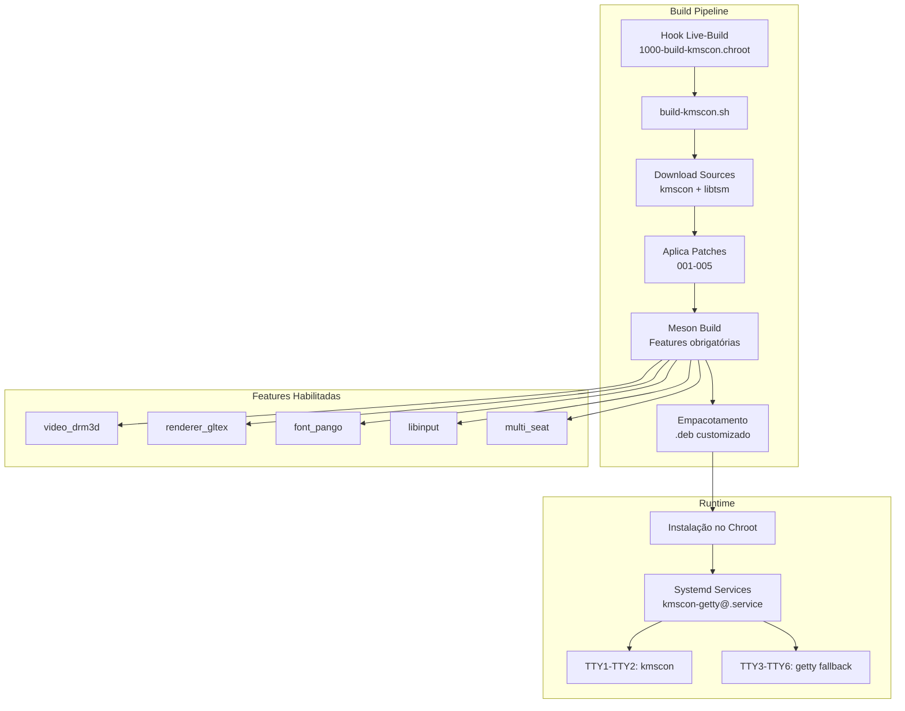
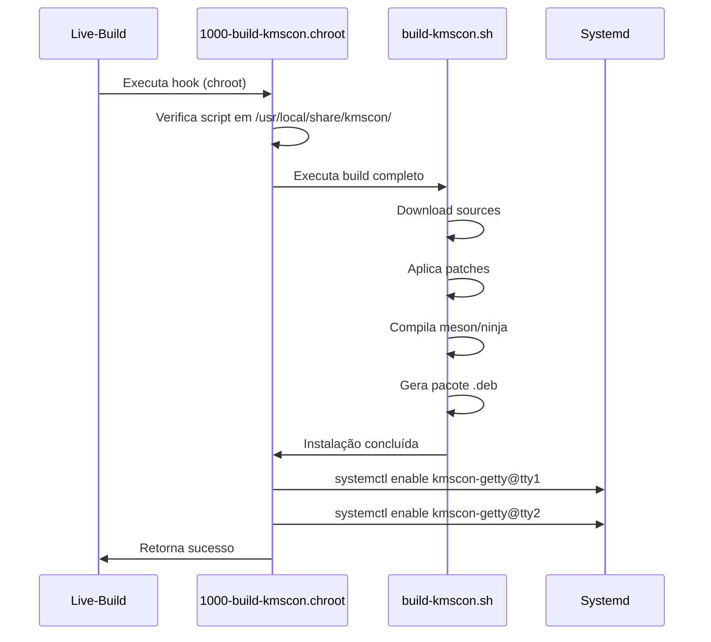

# Guia de Integração do KMSCON

## 1. Visão Geral

### 1.1 O que é o KMSCON

O **kmscon** (Kernel Mode Setting Console) é um console de sistema para Linux que utiliza **Kernel Mode Setting (KMS)** e **Direct Rendering Manager (DRM)** para fornecer uma experiência de terminal acelerada por hardware. É uma alternativa moderna aos consoles tradicionais do Linux (tty1-tty6) que oferece:

- **Renderização acelerada por GPU** via OpenGL ES 2.0
- **Suporte a true color** (24-bit, 16 milhões de cores)
- **Fontes vetoriais** com renderização via Pango/Cairo
- **Suporte a múltiplos assentos** (multi-seat) via systemd-logind
- **Suporte a input moderno** via libinput (touchpad, mouse, teclado)
- **Multi-monitor** e hardware cursor

### 1.2 Por que Usar o KMSCON no AURORA NAS

| Aspecto           | Console Linux Tradicional | KMSCON               |
| ----------------- | ------------------------- | -------------------- |
| **Renderização**  | CPU/Software              | GPU/DRM              |
| **Cores**         | 16-256 cores              | True color (24-bit)  |
| **Fontes**        | Bitmap fixas              | Vetoriais escaláveis |
| **HiDPI**         | Não suportado             | Suporte nativo       |
| **Touchpad**      | Limitado                  | Gestos completos     |
| **Design System** | Não aplicável             | Suporte total        |

O AURORA NAS utiliza o **Design System v2.0 Monocromático**, que requer:

1. True color para gradientes sutis
2. Fontes vetoriais para legibilidade em alta resolução
3. Renderização suave de caracteres Unicode

### 1.3 Arquitetura de Integração



## 2. Requisitos

### 2.1 Requisitos de Hardware

| Componente    | Requisito Mínimo         | Recomendado                              |
| ------------- | ------------------------ | ---------------------------------------- |
| **GPU**       | Qualquer GPU com DRM/KMS | Intel/AMD/NVIDIA com drivers open-source |
| **VRAM**      | 16MB                     | 64MB+                                    |
| **Resolução** | 800x600                  | 1920x1080 ou superior                    |
| **Input**     | Teclado USB/PS2          | Teclado + Touchpad                       |

### 2.2 Requisitos de Software

#### Sistema Operacional

- **Debian 13 Trixie** (ou compatível)
- Kernel Linux 6.x com suporte a DRM/KMS
- systemd 254+ (para logind integration)

#### Dependências de Build

```bash
# Compiladores e ferramentas
build-essential meson ninja-build pkg-config

# Bibliotecas de desenvolvimento
libdrm-dev libxkbcommon-dev libudev-dev libsystemd-dev
libpango1.0-dev libfontconfig1-dev libfreetype-dev
libgbm-dev libegl1-mesa-dev libgles2-mesa-dev
libinput-dev

# Ferramentas de empacotamento
dpkg-dev curl tar patch
```

#### Dependências de Runtime

```bash
libdrm2 libxkbcommon0 libudev1 libsystemd0
libpango-1.0-0 libfontconfig1 libfreetype6
libgbm1 libegl1 libgles2 libinput10
xkb-data libc6
```

### 2.3 Compatibilidade de Versões

| Componente | Versão Testada | Compatibilidade           |
| ---------- | -------------- | ------------------------- |
| kmscon     | 9.0.0          | ✓ Nativa                  |
| libtsm     | 4.0.2          | ✓ Empacotada internamente |
| meson      | 1.2.0+         | ✓ Requerido               |
| systemd    | 254+           | ✓ Integração logind       |

## 3. Instalação Manual

### 3.1 Download do Script

```bash
# Clone ou copie o diretório scripts/
cd /usr/local/src
wget https://github.com/aurora-nas/aurora-iso/releases/download/v2.0/kmscon-scripts.tar.gz
tar -xzf kmscon-scripts.tar.gz
cd kmscon-scripts
```

### 3.2 Execução do Build

```bash
# Build completo (requer root)
sudo bash scripts/build-kmscon.sh

# Com opções personalizadas
sudo bash scripts/build-kmscon.sh \
    --jobs 4 \
    --log-level DEBUG \
    --output /var/cache/kmscon \
    --keep
```

### 3.3 Variáveis de Ambiente

| Variável          | Padrão       | Descrição                               |
| ----------------- | ------------ | --------------------------------------- |
| `KMSCON_VERSION`  | 9.0.0        | Versão do kmscon a compilar             |
| `LIBTSM_VERSION`  | 4.0.2        | Versão da libtsm                        |
| `PARALLEL_JOBS`   | auto (nproc) | Jobs paralelos para compilação          |
| `KEEP_BUILD`      | 0            | Manter diretórios de build (1=sim)      |
| `LOG_LEVEL`       | INFO         | Nível de log (DEBUG, INFO, WARN, ERROR) |
| `CHECKSUM_VERIFY` | 1            | Verificar checksums de download         |

### 3.4 Estrutura de Diretórios

```
/tmp/kmscon-build/
├── src/
│   ├── kmscon-9.0.0/          # Source do kmscon
│   └── libtsm-4.0.2/          # Source da libtsm (se necessário)
├── build/
│   ├── kmscon/                # Build directory meson
│   └── libtsm/                # Build directory libtsm
└── package/
    └── kmscon-9.0.0/          # Estrutura do pacote .deb
        ├── DEBIAN/
        │   ├── control
        │   ├── postinst
        │   ├── prerm
        │   └── conffiles
        ├── usr/
        │   ├── bin/kmscon
        │   └── lib/
        └── etc/
            ├── kmscon/kmscon.conf
            └── systemd/system/kmscon-getty@.service
```

## 4. Integração com ISO (Live-Build)

### 4.1 Estrutura no Projeto

```
live_config/
└── config/
    ├── hooks/normal/
    │   └── 1000-build-kmscon.chroot    # Hook de build
    └── includes.chroot/
        └── usr/local/share/kmscon/
            ├── build-kmscon.sh         # Script principal
            ├── kmscon.conf             # Configuração
            ├── kmscon-getty@.service   # Service systemd
            ├── fontconfig-local.conf   # Fontconfig
            └── patches/                # Patches
                ├── 001-term-variable.patch
                ├── 002-plymouth-integration.patch
                ├── 003-logind-session.patch
                ├── 004-font-rendering.patch
                └── 005-libinput-touchpad.patch
```

### 4.2 Fluxo do Hook



### 4.3 Configuração do Hook

O hook `1000-build-kmscon.chroot` é executado com prioridade **1000** (tardia) para garantir que:

1. Todos os pacotes base estejam instalados
2. O ambiente de build esteja pronto
3. O systemd esteja disponível no chroot

```bash
#!/bin/bash
set -e

BUILD_SCRIPT="/usr/local/share/kmscon/build-kmscon.sh"
bash "$BUILD_SCRIPT" --log-level INFO --jobs auto

# Configura TTYs
for vt in tty1 tty2; do
    systemctl disable "getty@${vt}.service"
    systemctl enable "kmscon-getty@${vt}.service"
done
```

## 5. Configuração

### 5.1 Arquivo Principal: kmscon.conf

Local: `/etc/kmscon/kmscon.conf`

```ini
# =============================================================================
# Seção: General
# =============================================================================
[general]

# Terminal name para detecção de capacidades
term=kmscon

# Habilita 24-bit true color
use-true-color=true

# Fonte padrão
font-name=Monospace
font-size=16

# Scrollback buffer
scrollback-size=10000
scrollback-rows=10000

# Cursor piscante
cursor-blink=true
cursor-interval=500

# =============================================================================
# Seção: Graphics (Aceleração)
# =============================================================================
[graphics]

# Aceleração por hardware
hwaccel=true
drm=true
gpus=primary
render-engine=gltex
vsync=true

# =============================================================================
# Seção: Input (Teclado/Mouse)
# =============================================================================
[input]

# Libinput para mouse/touchpad
mouse=true
multi-seat=true

# Configuração do teclado (Brasil ABNT2)
xkb-layout=br
xkb-model=pc105
xkb-variant=abnt2
xkb-options=terminate:ctrl_alt_bksp

# Repetição de teclado
repeat-delay=250
repeat-rate=30

# =============================================================================
# Seção: Session
# =============================================================================
[session]
session-terminal=enabled
```

### 5.2 Tabela de Opções de Configuração

#### Seção `[general]`

| Opção             | Tipo   | Padrão    | Descrição              |
| ----------------- | ------ | --------- | ---------------------- |
| `term`            | string | kmscon    | Valor da variável TERM |
| `use-true-color`  | bool   | true      | Habilita cores 24-bit  |
| `font-name`       | string | Monospace | Família da fonte       |
| `font-size`       | int    | 16        | Tamanho em pontos      |
| `scrollback-size` | int    | 10000     | Linhas de histórico    |
| `cursor-blink`    | bool   | true      | Cursor piscante        |

#### Seção `[graphics]`

| Opção           | Tipo   | Padrão  | Descrição              |
| --------------- | ------ | ------- | ---------------------- |
| `hwaccel`       | bool   | true    | Aceleração GPU         |
| `drm`           | bool   | true    | Usar DRM/KMS           |
| `gpus`          | string | primary | Seleção de GPU         |
| `render-engine` | string | gltex   | Motor de renderização  |
| `vsync`         | bool   | true    | Sincronização vertical |

#### Seção `[input]`

| Opção           | Tipo   | Padrão | Descrição          |
| --------------- | ------ | ------ | ------------------ |
| `mouse`         | bool   | true   | Habilitar libinput |
| `multi-seat`    | bool   | true   | Suporte multi-seat |
| `xkb-layout`    | string | br     | Layout do teclado  |
| `xkb-model`     | string | pc105  | Modelo do teclado  |
| `xkb-variant`   | string | abnt2  | Variante do layout |
| `grab-keyboard` | bool   | true   | Isolar teclado     |

### 5.3 Configuração Fontconfig

Para melhor renderização de fontes, o arquivo `fontconfig-local.conf` deve ser instalado em:

- `/etc/fonts/local.conf` (global)
- Ou `$HOME/.config/fontconfig/fonts.conf` (usuário)

Principais configurações:

- **Subpixel rendering**: RGB
- **Hinting**: hintslight
- **Antialiasing**: Habilitado
- **Autohinter**: Habilitado

### 5.4 Service Systemd

O arquivo `kmscon-getty@.service` é um template systemd que gerencia instâncias do kmscon em TTYs específicos.

```ini
[Unit]
Description=KMS/DRM based system console on %I
After=systemd-user-sessions.service plymouth-quit-wait.service
Before=getty.target

[Service]
Type=simple
ExecStart=/usr/bin/kmscon --vt=%I --seats=seat0 --no-switchvt --login -- /bin/login -p
StandardInput=tty
StandardOutput=tty
TTYPath=/dev/%I
Restart=always
RestartSec=2

[Install]
WantedBy=getty.target
```

### 5.5 Gestão de Serviços

```bash
# Habilitar kmscon em tty1 e tty2
sudo systemctl enable kmscon-getty@tty1.service
sudo systemctl enable kmscon-getty@tty2.service

# Desabilitar getty padrão nestes TTYs
sudo systemctl disable getty@tty1.service
sudo systemctl disable getty@tty2.service

# Iniciar imediatamente
sudo systemctl start kmscon-getty@tty1.service

# Verificar status
sudo systemctl status kmscon-getty@tty1.service
```

## 6. Patches Específicos

### 6.1 Visão Geral dos Patches

O build aplica 5 patches específicos para o Debian 13 Trixie:

| #   | Patch                        | Propósito                                   |
| --- | ---------------------------- | ------------------------------------------- |
| 001 | `term-variable.patch`        | Define TERM=kmscon em vez de xterm-256color |
| 002 | `plymouth-integration.patch` | Coordenação com Plymouth durante boot       |
| 003 | `logind-session.patch`       | Previne busy-loop (100% CPU) com logind     |
| 004 | `font-rendering.patch`       | Otimiza renderização para HiDPI             |
| 005 | `libinput-touchpad.patch`    | Configurações otimizadas de touchpad        |

### 6.2 Patch 001: TERM Variable

**Problema**: O kmscon define `TERM=xterm-256color` por padrão, não permitindo que aplicações aproveitem recursos específicos.

**Solução**: Altera a definição para `TERM=kmscon` com fallback para `xterm-256color`.

**Arquivos modificados**:

- `src/terminal.c`
- `src/kmscon_module_interface.c`
- `src/pty.c`
- `src/app.c`

### 6.3 Patch 002: Plymouth Integration

**Problema**: Plymouth (boot splash) mantém DRM Master durante boot, causando conflitos.

**Solução**:

- Adiciona `plymouth_is_active()` para detectar Plymouth
- Implementa `wait_for_plymouth()` com exponential backoff
- Adiciona retry logic para abertura do dispositivo DRM
- Timeout configurável de 30 segundos

**Constantes**:

```c
#define PLYMOUTH_MAX_WAIT_MS 30000
#define PLYMOUTH_RETRY_DELAY_MS 100
```

### 6.4 Patch 003: Logind Session

**Problema**: Bugs conhecidos causam busy-loop (100% CPU) quando não consegue comunicar com systemd-logind.

**Solução**:

- Timeouts para operações dbus (5 segundos)
- Retry counter para evitar loops infinitos
- Modo fallback quando logind não está disponível
- `epoll_wait()` com verificação de eventos reais

**Constantes**:

```c
#define LOGIND_DBUS_TIMEOUT_MS 5000
#define LOGIND_RETRY_DELAY_US 100000
#define LOGIND_MAX_RETRIES 3
```

### 6.5 Patch 004: Font Rendering

**Problema**: Displays HiDPI/4K precisam de otimizações de renderização de fontes.

**Solução**:

- Detecção automática de densidade (GDK_SCALE, QT_SCALE_FACTOR)
- Subpixel rendering RGB/BGR configurável
- Ajuste dinâmico de DPI
- Cache de glyphs otimizado

**Variáveis de ambiente**:

- `GDK_SCALE` - Escala GTK
- `QT_SCALE_FACTOR` - Fator de escala Qt

### 6.6 Patch 005: Libinput Touchpad

**Problema**: Configurações padrão do libinput não incluem recursos esperados em laptops modernos.

**Solução**:

- Tap-to-click habilitado
- Natural scrolling
- Tap-and-drag
- Aceleração adaptativa
- Palm detection
- Disable-while-typing

**Configurações**:

```ini
[input]
tap-to-click=true
natural-scroll=true
accel-speed=0.0
disable-while-typing=true
```

## 7. Troubleshooting

### 7.1 Problemas de Build

#### Erro: "Meson não encontrado"

```
[ERROR] Comandos não encontrados: meson
```

**Solução**:

```bash
sudo apt-get install meson ninja-build
```

#### Erro: "Bibliotecas faltando"

```
[WARN] Bibliotecas faltando: libdrm libinput
```

**Solução**:

```bash
sudo apt-get install libdrm-dev libinput-dev
```

#### Erro: "Patch não aplicável"

```
[WARN] Patch não aplicável (pode já estar aplicado): 001-term-variable.patch
```

**Solução**: Normalmente informativo. Se build falhar:

```bash
# Limpar e reconstruir
sudo rm -rf /tmp/kmscon-build
sudo bash scripts/build-kmscon.sh --clean
```

### 7.2 Problemas de Runtime

#### Erro: "Cannot open DRM device"

```
[ERROR] Cannot open DRM device /dev/dri/card0: EACCES
```

**Causas**:

1. Plymouth ainda ativo
2. Outro processo detém DRM Master
3. Permissões insuficientes

**Soluções**:

```bash
# Verificar Plymouth
sudo systemctl status plymouth

# Verificar quem detém o DRM
sudo lsof /dev/dri/card0

# Reiniciar kmscon
sudo systemctl restart kmscon-getty@tty1.service
```

#### Erro: "100% CPU usage"

```
# top mostra kmscon consumindo 100% CPU
```

**Causa**: Loop infinito na comunicação com logind

**Solução**: O patch 003 resolve isso. Se persistir:

```bash
# Desabilitar logind integration temporariamente
# Editar /etc/kmscon/kmscon.conf
[session]
session-terminal=disabled
```

#### Erro: "Fontes borradas em HiDPI"

**Solução**:

```bash
# Configurar variáveis de ambiente
export GDK_SCALE=2
export QT_SCALE_FACTOR=2

# Ou ajustar DPI no kmscon.conf
[font]
font-size=24
```

### 7.3 Problemas de Input

#### Touchpad não responde

```bash
# Verificar se libinput está carregado
sudo libinput list-devices

# Verificar logs
sudo journalctl -u kmscon-getty@tty1.service -f
```

#### Teclado com layout incorreto

```bash
# Verificar configuração atual
cat /etc/kmscon/kmscon.conf | grep xkb

# Testar layout
setxkbmap -query
```

### 7.4 Debug Avançado

#### Habilitar Debug Detalhado

```bash
# No script de build
sudo LOG_LEVEL=DEBUG bash scripts/build-kmscon.sh

# No runtime (editar service)
sudo systemctl edit kmscon-getty@tty1.service
```

```ini
# Adicionar:
[Service]
Environment="KMSCON_DEBUG=1"
ExecStart=
ExecStart=/usr/bin/kmscon --vt=%I --debug --login -- /bin/login -p
```

#### Verificar Logs

```bash
# Logs do build
cat /var/log/kmscon-build.log

# Logs do systemd
sudo journalctl -u kmscon-getty@tty1.service

# Logs do kernel (DRM)
sudo dmesg | grep -i drm
```

### 7.5 Fallback para Getty

Se o kmscon falhar completamente, o sistema mantém getty nos TTYs 3-6:

```bash
# Acessar console de recuperação
Ctrl+Alt+F3  # ou F4, F5, F6

# Fazer login com getty padrão
# Diagnosticar problema
sudo systemctl status kmscon-getty@tty1
```

## 8. Referências

### 8.1 Documentação Upstream

- **KMSCON GitHub**: https://github.com/kmscon/kmscon
- **libtsm GitHub**: https://github.com/kmscon/libtsm
- **freedesktop DRM**: https://dri.freedesktop.org/wiki/DRM/

### 8.2 Documentação Debian

- **Live-Build Manual**: https://live-team.pages.debian.net/live-manual/
- **Meson Build System**: https://mesonbuild.com/
- **Systemd Getty**: https://www.freedesktop.org/software/systemd/man/systemd-getty-generator.html

### 8.3 Documentação do Projeto

| Documento                                                   | Descrição                    |
| ----------------------------------------------------------- | ---------------------------- |
| [`DESIGN_SYSTEM_v2.0.md`](DESIGN_SYSTEM_v2.0.md)            | Sistema visual monocromático |
| [`GUIA_CREATE_INSTALLER.md`](GUIA_CREATE_INSTALLER.md)      | Guia do instalador           |
| [`KMSCON_QUICKSTART.md`](KMSCON_QUICKSTART.md)              | Guia rápido de referência    |
| [`KMSCON_SCRIPT_API.md`](KMSCON_SCRIPT_API.md)              | API do script de build       |
| [`scripts/patches/README.md`](../scripts/patches/README.md) | Documentação dos patches     |

### 8.4 Recursos Adicionais

- **libinput Documentation**: https://wayland.freedesktop.org/libinput/doc/latest/
- **Pango Reference**: https://docs.gtk.org/Pango/
- **Fontconfig User Guide**: https://www.freedesktop.org/software/fontconfig/fontconfig-user.html

---

## Apêndice A: Códigos de Saída

| Código | Constante               | Significado                        |
| ------ | ----------------------- | ---------------------------------- |
| 0      | `EXIT_SUCCESS`          | Sucesso                            |
| 1      | `EXIT_ERROR`            | Erro genérico                      |
| 10     | `EXIT_NOT_ROOT`         | Script não executado como root     |
| 11     | `EXIT_BASH_OLD`         | Bash versão < 4.0                  |
| 12     | `EXIT_DEPS_MISSING`     | Dependências faltando              |
| 20     | `EXIT_DOWNLOAD_FAILED`  | Falha no download                  |
| 21     | `EXIT_CHECKSUM_INVALID` | Checksum inválido                  |
| 30     | `EXIT_PATCH_FAILED`     | Falha na aplicação de patch        |
| 40     | `EXIT_CONFIGURE_FAILED` | Falha na configuração meson        |
| 41     | `EXIT_FEATURE_MISSING`  | Feature obrigatória não habilitada |
| 50     | `EXIT_BUILD_FAILED`     | Falha na compilação                |
| 60     | `EXIT_PACKAGE_FAILED`   | Falha no empacotamento             |
| 70     | `EXIT_INSTALL_FAILED`   | Falha na instalação                |
| 71     | `EXIT_SYSTEMD_FAILED`   | Falha na configuração systemd      |

## Apêndice B: Features do Meson

| Feature            | Status   | Descrição                   |
| ------------------ | -------- | --------------------------- |
| `video_drm3d`      | enabled  | Aceleração 3D via DRM       |
| `renderer_gltex`   | enabled  | Renderizador OpenGL texture |
| `font_pango`       | enabled  | Fontes via Pango            |
| `libinput`         | enabled  | Input via libinput          |
| `multi_seat`       | enabled  | Suporte multi-seat          |
| `session_terminal` | enabled  | Sessão de terminal          |
| `font_unifont`     | enabled  | Fonte fallback unifont      |
| `extra_debug`      | disabled | Debug extra                 |

---

**Versão do Documento**: 1.0.0  
**Última Atualização**: 2026-01-31  
**Compatibilidade**: Debian 13 Trixie, kmscon 9.0.0
