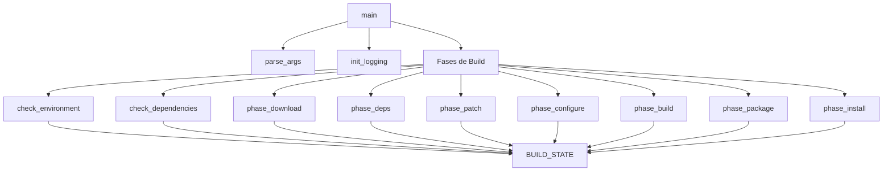

# KMSCON Script API Documentation

Documentação técnica completa da API do script [`build-kmscon.sh`](../scripts/build-kmscon.sh).

---

## Índice

1. [Visão Geral](#visão-geral)
2. [Constantes](#constantes)
3. [Funções Públicas](#funções-públicas)
4. [Funções de Fase](#funções-de-fase)
5. [Logging](#logging)
6. [Utilitários](#utilitários)
7. [Exemplos de Uso](#exemplos-de-uso)

---

## Visão Geral

### Arquitetura do Script



O script utiliza uma arquitetura de **fases sequenciais**, onde cada fase consome e atualiza o estado global `BUILD_STATE` (associative array).

---

## Constantes

### Códigos de Saída

```bash
readonly EXIT_SUCCESS=0           # Build concluído com sucesso
readonly EXIT_ERROR=1             # Erro genérico
readonly EXIT_NOT_ROOT=10         # Não executado como root
readonly EXIT_BASH_OLD=11         # Bash < 4.0
readonly EXIT_DEPS_MISSING=12     # Dependências faltando
readonly EXIT_DOWNLOAD_FAILED=20  # Falha no download
readonly EXIT_CHECKSUM_INVALID=21 # Checksum inválido
readonly EXIT_PATCH_FAILED=30     # Falha em patch
readonly EXIT_CONFIGURE_FAILED=40 # Falha na configuração meson
readonly EXIT_FEATURE_MISSING=41  # Feature obrigatória não habilitada
readonly EXIT_BUILD_FAILED=50     # Falha na compilação
readonly EXIT_PACKAGE_FAILED=60   # Falha no empacotamento
readonly EXIT_INSTALL_FAILED=70   # Falha na instalação
readonly EXIT_SYSTEMD_FAILED=71   # Falha na configuração systemd
```

### Versões Padrão

```bash
readonly KMSCON_VERSION="${KMSCON_VERSION:-9.0.0}"
readonly LIBTSM_VERSION="${LIBTSM_VERSION:-4.0.2}"
```

### URLs de Download

```bash
readonly KMSCON_URL="${KMSCON_URL:-https://github.com/kmscon/kmscon/releases/download/v${KMSCON_VERSION}/kmscon-${KMSCON_VERSION}.tar.xz}"
readonly LIBTSM_URL="${LIBTSM_URL:-https://github.com/kmscon/libtsm/releases/download/v${LIBTSM_VERSION}/libtsm-${LIBTSM_VERSION}.tar.xz}"
```

### Diretórios

```bash
readonly BUILD_ROOT="${BUILD_ROOT:-/tmp/kmscon-build}"
readonly CACHE_DIR="${CACHE_DIR:-${SCRIPT_DIR}/.cache}"
readonly PATCHES_DIR="${PATCHES_DIR:-${SCRIPT_DIR}/patches}"
readonly OUTPUT_DIR="${OUTPUT_DIR:-/var/cache/kmscon-build}"
readonly PACKAGE_ROOT="${BUILD_ROOT}/package/kmscon-${KMSCON_VERSION}"
```

### Features Obrigatórias

```bash
readonly REQUIRED_FEATURES=(
    "video_drm3d"
    "renderer_gltex"
    "font_pango"
    "libinput"
    "multi_seat"
    "session_terminal"
)
```

### Systemd

```bash
readonly KMSCON_VTS="${KMSCON_VTS:-tty1 tty2}"
readonly KMSCON_SEATS="${KMSCON_SEATS:-seat0}"
```

---

## Variáveis de Estado

### BUILD_STATE

Array associativo que mantém o estado do build entre as fases:

| Chave                | Tipo      | Descrição                    |
| -------------------- | --------- | ---------------------------- |
| `env_checked`        | int (0/1) | Ambiente verificado          |
| `deps_checked`       | int (0/1) | Dependências verificadas     |
| `need_libtsm_build`  | int (0/1) | Precisa compilar libtsm      |
| `download_complete`  | int (0/1) | Download concluído           |
| `kmscon_src`         | string    | Caminho do source kmscon     |
| `libtsm_src`         | string    | Caminho do source libtsm     |
| `deps_complete`      | int (0/1) | Dependências compiladas      |
| `patch_complete`     | int (0/1) | Patches aplicados            |
| `configure_complete` | int (0/1) | Meson configurado            |
| `build_dir`          | string    | Diretório de build           |
| `binary_path`        | string    | Caminho do binário compilado |
| `build_complete`     | int (0/1) | Build concluído              |
| `deb_path`           | string    | Caminho do pacote .deb       |
| `package_complete`   | int (0/1) | Empacotamento concluído      |
| `install_complete`   | int (0/1) | Instalação concluída         |

### CURRENT_PHASE

Índice numérico da fase atual (0-8):

```bash
declare -i CURRENT_PHASE=0
declare -a PHASE_NAMES=("setup" "download" "deps" "patch" "configure" "build" "package" "install")
```

---

## Funções Públicas

### main()

```bash
main [ARGUMENTOS...]
```

Função principal que orquestra todo o build. Processa argumentos e executa as fases em sequência.

**Fluxo de Execução:**

1. `parse_args "$@"` - Processa argumentos CLI
2. `init_logging` - Inicializa sistema de log
3. `check_environment` - Verifica ambiente
4. `check_dependencies` - Verifica dependências
5. `phase_download` - Download de sources
6. `phase_deps` - Build de dependências
7. `phase_patch` - Aplica patches
8. `phase_configure` - Configura meson
9. `phase_build` - Compila
10. `phase_package` - Empacota
11. `phase_install` - Instala

**Retorno:** Código de saída apropriado (veja [Constantes](#constantes))

**Exemplo:**

```bash
# Execução padrão
main "$@"

# Equivalente a:
bash build-kmscon.sh
```

---

### parse_args()

```bash
parse_args [OPÇÕES...]
```

Processa argumentos de linha de comando.

**Opções Suportadas:**

| Opção                   | Descrição                                      |
| ----------------------- | ---------------------------------------------- |
| `-h, --help`            | Mostra ajuda e sai                             |
| `-v, --version`         | Mostra versão e sai                            |
| `-k, --keep`            | Mantém diretório de build (`KEEP_BUILD=1`)     |
| `-c, --clean`           | Limpa cache e build antes de iniciar           |
| `-j, --jobs N`          | Define número de jobs paralelos                |
| `-l, --log-level LEVEL` | Define nível de log (DEBUG, INFO, WARN, ERROR) |
| `-o, --output DIR`      | Define diretório de saída                      |

**Exemplo:**

```bash
# Parse manual (raramente necessário)
parse_args --jobs 4 --log-level DEBUG --keep
```

---

### show_usage()

```bash
show_usage
```

Exibe mensagem de ajuda formatada.

**Saída:** Documentação de uso no stderr

---

### show_version()

```bash
show_version
```

Exibe versão do script.

**Saída:** String de versão no stdout

---

## Funções de Fase

### check_environment()

```bash
check_environment
```

**Fase 1**: Verifica pré-condições do ambiente.

**Verificações:**

- Executando como root (`$EUID -eq 0`)
- Versão do Bash >= 4.0
- Ambiente chroot (informativo)
- Criação de diretórios necessários

**Atualizações de Estado:**

- `BUILD_STATE[env_checked]=1`

**Retornos:**

- `EXIT_SUCCESS` (0) - Ambiente OK
- `EXIT_NOT_ROOT` (10) - Não é root
- `EXIT_BASH_OLD` (11) - Bash antigo
- `EXIT_ERROR` (1) - Falha ao criar diretórios

**Exemplo:**

```bash
if ! check_environment; then
    exit $?
fi
```

---

### check_dependencies()

```bash
check_dependencies
```

**Fase 2**: Verifica dependências de build e runtime.

**Verifica:**

- Comandos: meson (>=0.55.0), ninja, gcc, pkg-config, dpkg-deb, curl, tar, patch
- Bibliotecas: libdrm, xkbcommon, udev, systemd, pango, fontconfig, freetype2, gbm, egl, glesv2, libinput
- libtsm >= 4.3.0

**Ações:**

- Se bibliotecas faltarem, chama `install_build_deps`
- Se libtsm < 4.3.0, marca `BUILD_STATE[need_libtsm_build]=1`

**Atualizações de Estado:**

- `BUILD_STATE[deps_checked]=1`
- `BUILD_STATE[need_libtsm_build]` (condicional)

**Retornos:**

- `EXIT_SUCCESS` (0) - Todas as dependências OK
- `EXIT_DEPS_MISSING` (12) - Dependências faltando

---

### install_build_deps()

```bash
install_build_deps
```

Instala dependências de build via apt-get.

**Pacotes Instalados:**

```bash
build-essential meson ninja-build pkg-config dpkg-dev curl tar patch
libdrm-dev libxkbcommon-dev libudev-dev libsystemd-dev
libpango1.0-dev libfontconfig1-dev libfreetype-dev
libgbm-dev libegl1-mesa-dev libgles2-mesa-dev libinput-dev
```

**Retornos:**

- 0 - Sucesso
- 1 - Falha

---

### check_libtsm_version()

```bash
check_libtsm_version
```

Verifica se libtsm >= 4.3.0 está instalada.

**Retornos:**

- 0 - libtsm OK (>= 4.3.0)
- 1 - libtsm não encontrada ou versão antiga

**Exemplo:**

```bash
if ! check_libtsm_version; then
    BUILD_STATE[need_libtsm_build]=1
fi
```

---

### phase_download()

```bash
phase_download
```

**Fase 3**: Download dos sources.

**Ações:**

1. Chama `download_kmscon`
2. Se necessário, chama `download_libtsm`

**Atualizações de Estado:**

- `BUILD_STATE[download_complete]=1`
- `BUILD_STATE[kmscon_src]`
- `BUILD_STATE[libtsm_src]` (condicional)

**Retornos:**

- `EXIT_SUCCESS` (0) - Download OK
- `EXIT_DOWNLOAD_FAILED` (20) - Falha no download

---

### download_kmscon()

```bash
download_kmscon
```

Download e extração do source do kmscon.

**Cache:** Verifica `CACHE_DIR/kmscon-${KMSCON_VERSION}.tar.xz`

**Download:** Usa curl com retry (3 tentativas, 5s delay)

**Extração:** Descompacta para `BUILD_ROOT/src/`

**Atualizações de Estado:**

- `BUILD_STATE[kmscon_src]="${BUILD_ROOT}/src"`

**Retornos:**

- 0 - Sucesso
- 1 - Falha

---

### download_libtsm()

```bash
download_libtsm
```

Download e extração do source do libtsm.

**Fallback:** Se download falhar, tenta `clone_libtsm_from_git`

**Retornos:**

- 0 - Sucesso
- 1 - Falha

---

### clone_libtsm_from_git()

```bash
clone_libtsm_from_git
```

Clone do repositório git como fallback.

**Comando:**

```bash
git clone --depth 1 --branch "v${LIBTSM_VERSION}" \
    "https://github.com/kmscon/libtsm.git"
```

**Retornos:**

- 0 - Sucesso
- 1 - Falha

---

### phase_deps()

```bash
phase_deps
```

**Fase 4**: Build de dependências.

**Ações:**

- Se `BUILD_STATE[need_libtsm_build]=1`, chama `build_libtsm`

**Atualizações de Estado:**

- `BUILD_STATE[deps_complete]=1`

**Retornos:**

- `EXIT_SUCCESS` (0) - OK
- `EXIT_BUILD_FAILED` (50) - Falha

---

### build_libtsm()

```bash
build_libtsm
```

Compila e instala a libtsm.

**Meson Options:**

```bash
--prefix=/usr
--buildtype=release
-Ddocs=false
-Dtests=false
```

**Instalação:**

```bash
ninja -C "$build_dir" install
ldconfig  # Atualiza cache do pkg-config
```

**Retornos:**

- 0 - Sucesso
- 1 - Falha

---

### phase_patch()

```bash
phase_patch
```

**Fase 5**: Aplicação de patches.

**Processo:**

1. Lista arquivos `*.patch` e `*.diff` em `PATCHES_DIR`
2. Para cada patch: testa com `--dry-run`, depois aplica
3. Conta patches aplicados e falhas

**Ordem de Aplicação:** Numérica (001, 002, ...)

**Atualizações de Estado:**

- `BUILD_STATE[patch_complete]=1`

**Retornos:**

- `EXIT_SUCCESS` (0) - Concluído (patches podem falhar sem erro fatal)

**Exemplo de Saída:**

```
[INFO] Aplicando patch: 001-term-variable.patch
[INFO] Patch aplicado: 001-term-variable.patch
[INFO] Patches aplicados: 5, falhas: 0
```

---

### phase_configure()

```bash
phase_configure
```

**Fase 6**: Configuração do meson.

**Meson Options:**

```bash
--prefix=/usr
--buildtype=release
-Dvideo_drm3d=enabled
-Drenderer_gltex=enabled
-Dfont_pango=enabled
-Dlibinput=enabled
-Dmulti_seat=enabled
-Dsession_terminal=enabled
-Dfont_unifont=enabled
-Dextra_debug=false
```

**Verificações:**

- Chama `verify_features` para confirmar features habilitadas

**Atualizações de Estado:**

- `BUILD_STATE[configure_complete]=1`
- `BUILD_STATE[build_dir]`

**Retornos:**

- `EXIT_SUCCESS` (0) - Configuração OK
- `EXIT_CONFIGURE_FAILED` (40) - Falha na configuração
- `EXIT_FEATURE_MISSING` (41) - Feature obrigatória não habilitada

---

### verify_features()

```bash
verify_features BUILD_DIR
```

Verifica se features obrigatórias foram habilitadas.

**Parâmetros:**

- `BUILD_DIR`: Diretório de build do meson

**Retornos:**

- 0 - Todas as features OK
- 1 - Alguma feature faltando

---

### phase_build()

```bash
phase_build
```

**Fase 7**: Compilação.

**Comando:**

```bash
ninja -C "$build_dir" -j "$PARALLEL_JOBS"
```

**Verificações:**

- Confirma que binário `kmscon` foi criado

**Atualizações de Estado:**

- `BUILD_STATE[build_complete]=1`
- `BUILD_STATE[binary_path]`

**Retornos:**

- `EXIT_SUCCESS` (0) - Build OK
- `EXIT_BUILD_FAILED` (50) - Falha na compilação

---

### phase_package()

```bash
phase_package
```

**Fase 8**: Empacotamento .deb.

**Sub-fases:**

1. `create_deb_structure` - Cria hierarquia do pacote
2. `generate_control` - Gera DEBIAN/control e scripts
3. `copy_build_artifacts` - Copia binários e configs
4. `build_deb` - Executa dpkg-deb

**Atualizações de Estado:**

- `BUILD_STATE[package_complete]=1`
- `BUILD_STATE[deb_path]`

**Retornos:**

- `EXIT_SUCCESS` (0) - Pacote criado
- `EXIT_PACKAGE_FAILED` (60) - Falha

---

### create_deb_structure()

```bash
create_deb_structure
```

Cria hierarquia de diretórios do pacote.

**Estrutura Criada:**

```
PACKAGE_ROOT/
├── DEBIAN/
├── usr/bin/
├── usr/lib/
├── etc/kmscon/
├── etc/systemd/system/
├── usr/share/doc/kmscon/
└── usr/share/kmscon/
```

---

### generate_control()

```bash
generate_control
```

Gera metadados do pacote DEB.

**Arquivos Gerados:**

- `DEBIAN/control` - Metadados do pacote
- `DEBIAN/postinst` - Script pós-instalação
- `DEBIAN/prerm` - Script pré-remoção
- `DEBIAN/conffiles` - Arquivos de configuração
- `usr/share/doc/kmscon/copyright` - Licença

**Template do Control:**

```
Package: kmscon
Version: ${KMSCON_VERSION}
Section: utils
Priority: optional
Architecture: ${arch}
Depends: libdrm2, libxkbcommon0, libudev1, libsystemd0, ...
Suggests: libtsm0 (>= 4.3.0)
```

---

### copy_build_artifacts()

```bash
copy_build_artifacts
```

Copia artefatos de build para a estrutura do pacote.

**Arquivos Copiados:**

- `kmscon` → `usr/bin/`
- `*.so*` → `usr/lib/`
- `kmscon.conf` → `etc/kmscon/`
- `kmscon-getty@.service` → `etc/systemd/system/`

---

### build_deb()

```bash
build_deb
```

Constroi o pacote .deb final.

**Comando:**

```bash
dpkg-deb --build "$PACKAGE_ROOT" "$deb_path"
```

**Verificação Opcional:**

```bash
lintian "$deb_path"  # Se disponível
```

---

### phase_install()

```bash
phase_install
```

**Fase 9**: Instalação no sistema.

**Sub-fases:**

1. `install_package` - Instala o .deb
2. `configure_systemd` - Configura serviços
3. `verify_installation` - Verifica instalação

**Atualizações de Estado:**

- `BUILD_STATE[install_complete]=1`

**Retornos:**

- `EXIT_SUCCESS` (0) - Instalação OK
- `EXIT_INSTALL_FAILED` (70) - Falha na instalação
- `EXIT_SYSTEMD_FAILED` (71) - Falha no systemd

---

### install_package()

```bash
install_package DEB_PATH
```

Instala o pacote .deb.

**Parâmetros:**

- `DEB_PATH`: Caminho para o arquivo .deb

**Processo:**

```bash
dpkg -i "$deb_path" || apt-get install -f -y
```

---

### configure_systemd()

```bash
configure_systemd
```

Configura serviços systemd.

**Ações:**

- Recarrega systemd (`systemctl daemon-reload`)
- Desabilita getty em `$KMSCON_VTS`
- Habilita kmscon-getty em `$KMSCON_VTS`
- Mantém getty em tty3-tty6 como fallback

---

### verify_installation()

```bash
verify_installation
```

Verifica se a instalação foi bem-sucedida.

**Verificações:**

- Binário `/usr/bin/kmscon` existe e é executável
- Binário responde a `--help` ou `--version`
- Service file existe
- Configuração existe

---

## Logging

### init_logging()

```bash
init_logging
```

Inicializa o sistema de log.

**Ações:**

- Cria diretório do log se necessário
- Limpa log anterior
- Escreve mensagem de inicialização

---

### Funções de Log

```bash
log_debug "Mensagem de debug"
log_info "Mensagem informativa"
log_warn "Mensagem de aviso"
log_error "Mensagem de erro"
log_fatal "Mensagem fatal"
```

**Níveis de Log:**

- `DEBUG` - Informações detalhadas de debug
- `INFO` - Informações gerais (padrão)
- `WARN` - Avisos
- `ERROR` - Erros
- `FATAL` - Erros fatais

**Controle via `LOG_LEVEL`:**

```bash
LOG_LEVEL=DEBUG  # Mostra DEBUG e superior
LOG_LEVEL=INFO   # Mostra INFO, WARN, ERROR, FATAL
LOG_LEVEL=WARN   # Mostra WARN, ERROR, FATAL
```

**Formato:**

```
[TIMESTAMP] [LEVEL] Mensagem
```

**Saída:**

- Arquivo: `$LOG_FILE` (padrão: `/var/log/kmscon-build.log`)
- STDERR: Com cores se TTY

---

## Utilitários

### version_gte()

```bash
version_gte CURRENT_VERSION REQUIRED_VERSION
```

Compara versões semânticas.

**Parâmetros:**

- `CURRENT_VERSION`: Versão atual (ex: "1.2.3")
- `REQUIRED_VERSION`: Versão mínima requerida

**Retornos:**

- 0 - Versão atual >= requerida
- 1 - Versão atual < requerida

**Exemplo:**

```bash
if version_gte "1.2.0" "1.0.0"; then
    echo "Versão OK"
fi
```

---

### get_version()

```bash
get_version COMANDO [FLAG_VERSION]
```

Extrai versão de um comando.

**Parâmetros:**

- `COMANDO`: Comando a verificar
- `FLAG_VERSION`: Flag de versão (padrão: `--version`)

**Retorno:** String da versão (stdout)

**Exemplo:**

```bash
version=$(get_version "meson")
echo "Meson version: $version"  # 1.2.0
```

---

### progress()

```bash
progress ATUAL TOTAL
```

Exibe barra de progresso simples.

**Parâmetros:**

- `ATUAL`: Valor atual (int)
- `TOTAL`: Valor total (int)

**Exemplo:**

```bash
for i in {1..100}; do
    progress $i 100
    sleep 0.1
done
echo  # Nova linha
```

**Saída:**

```
[========================>                    ] 45%
```

---

### cleanup()

```bash
cleanup
```

Função de cleanup chamada em EXIT, INT, TERM.

**Ações:**

- Log do código de saída em caso de erro
- Remove `BUILD_ROOT` se `KEEP_BUILD=0`
- Mantém diretórios se `KEEP_BUILD=1`

**Registro:**

```bash
trap cleanup EXIT INT TERM
```

---

## Exemplos de Uso

### Exemplo 1: Build Padrão

```bash
#!/bin/bash
# build-standard.sh

set -e

# Exportar variáveis se necessário
export KMSCON_VERSION="9.0.0"
export LOG_LEVEL="INFO"

# Executar build
bash scripts/build-kmscon.sh

echo "Build concluído!"
```

### Exemplo 2: Build com Debug

```bash
#!/bin/bash
# build-debug.sh

# Preservar diretórios para análise
export KEEP_BUILD=1
export LOG_LEVEL="DEBUG"
export PARALLEL_JOBS=2  # Menos paralelismo = logs mais claros

# Limpar e rebuild
bash scripts/build-kmscon.sh --clean

# Analisar build
cat /var/log/kmscon-build.log
cd /tmp/kmscon-build/build/kmscon
meson introspect --buildoptions
```

### Exemplo 3: Integração com CI

```bash
#!/bin/bash
# ci-build.sh

set -euo pipefail

# Configurações para CI
export LOG_LEVEL="ERROR"  # Menos verboso
export PARALLEL_JOBS=$(nproc)

# Build
if ! bash scripts/build-kmscon.sh; then
    echo "::error::Build falhou"
    cat /var/log/kmscon-build.log
    exit 1
fi

# Verificar pacote
if [[ ! -f /var/cache/kmscon-build/kmscon_*.deb ]]; then
    echo "::error::Pacote não encontrado"
    exit 1
fi

# Upload artifact (exemplo GitHub Actions)
# actions/upload-artifact@v3
#   with:
#     name: kmscon-package
#     path: /var/cache/kmscon-build/*.deb
```

### Exemplo 4: Customização de Features

```bash
#!/bin/bash
# build-custom.sh

# Patch personalizado antes do build
cd /tmp/kmscon-build/src

# Aplicar patch customizado
patch -p1 < /path/to/my-custom.patch

# Executar fases manualmente (após download)
source scripts/build-kmscon.sh

# Pular para fase de configuração
phase_configure
phase_build
phase_package
```

### Exemplo 5: Verificação de Instalação

```bash
#!/bin/bash
# verify-install.sh

source scripts/build-kmscon.sh

# Verificar ambiente
if ! check_environment; then
    echo "Ambiente não preparado"
    exit 1
fi

# Verificar dependências
if ! check_dependencies; then
    echo "Dependências faltando"
    exit 1
fi

echo "Sistema pronto para build"
```

---

## Referências Cruzadas

- **Guia de Integração**: [`KMSCON_INTEGRATION_GUIDE.md`](KMSCON_INTEGRATION_GUIDE.md)
- **Quick Start**: [`KMSCON_QUICKSTART.md`](KMSCON_QUICKSTART.md)
- **Documentação dos Patches**: [`scripts/patches/README.md`](../scripts/patches/README.md)
- **Código Fonte**: [`scripts/build-kmscon.sh`](../scripts/build-kmscon.sh)

---

**Versão da API**: 1.0.0  
**Script**: build-kmscon.sh  
**Última Atualização**: 2026-01-31
