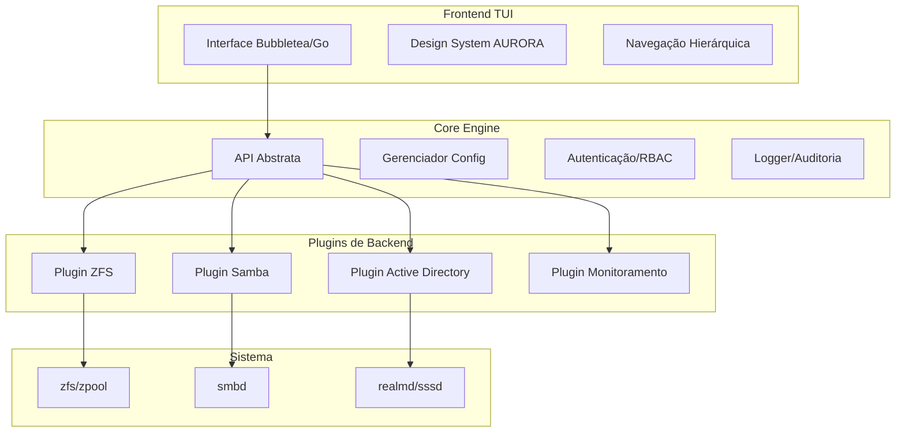

# 🔍 ANÁLISE PROATIVA DA SOLICITAÇÃO

## 📋 **Resumo da Solicitação Original**

Desenvolver uma TUI (Text User Interface) completa para administração de NAS baseada em terminal, substituindo interfaces web tradicionais como FreeNAS/TrueNAS, com foco em:

- Gestão SMB/CIFS via Samba
- Administração ZFS (pools, datasets, snapshots)
- Integração Active Directory/LDAP
- Design System AURORA v2.0 já estabelecido

---

## ⚠️ **Pontos de Atenção Identificados**

### 1. **Escopo Extremamente Abrangente**

A solicitação cobre múltiplos subsistemas complexos (ZFS, Samba, AD, monitoramento) que normalmente exigiriam equipes especializadas. Uma implementação monolítica seria difícil de manter.

### 2. **Ausência de Arquitetura de Segurança**

Operações destrutivas no ZFS (destruição de pools) e manipulação de ACLs requerem:

- Sistema de confirmação multi-nível
- Logging de auditoria
- Controle de acesso baseado em roles (RBAC)

### 3. **Dependências de Bibliotecas TUI**

O Design System atual usa `gum` (charmbracelet). Para uma aplicação complexa com múltiplas telas e estados, precisamos avaliar:

- `gum` (shell-based, limitado para apps complexos)
- `bubbletea` (Go - mais robusto para TUI stateful)
- `textual` (Python - alternativa rica em componentes)
- `ratatui` (Rust - performance máxima)

### 4. **Persistência de Configuração**

Onde as configurações serão armazenadas?

- Arquivos YAML/JSON?
- SQLite local?
- Integração com sistema de configuração do Debian?

### 5. **Testabilidade em Ambientes Corporativos**

- Simulação de ambientes AD/ZFS para desenvolvimento
- Testes em containers vs. hardware real

---

## 🚀 **Propostas de Melhoria**

### Melhoria 1: **Arquitetura em Camadas com Plugin System**



**Benefício**: Cada subsistema (ZFS, Samba, AD) pode ser desenvolvido e testado isoladamente. Facilita contribuições e manutenção.

---

### Melhoria 2: **Padrão de Comandos com Validação**

Ao invés de executar comandos shell diretamente, usar uma camada de abstração:

```go
// Exemplo conceitual
type ZFSCommand struct {
    Operation   string   // "create", "destroy", "snapshot"
    Pool        string
    Dataset     string
    DryRun      bool     // Simulação antes de executar
    RequireConfirm bool  // Confirmação para operações destrutivas
    AuditLog    bool     // Sempre true para destroy
}
```

---

### Melhoria 3: **Sistema de Wizards Reutilizável**

Criar um framework de wizard genérico:

```
┌─────────────────────────────────────────┐
│  Wizard: Configuração SMB               │
│  ─────────────────────────────────────  │
│                                         │
│  [●] Passo 1: Seleção de Dataset        │
│  [○] Passo 2: Configurações Básicas     │
│  [○] Passo 3: Permissões ACL            │
│  [○] Passo 4: Revisão e Confirmação     │
│                                         │
│  [Voltar]  [Próximo]  [Cancelar]        │
└─────────────────────────────────────────┘
```

---

### Melhoria 4: **Dashboard de Monitoramento em Tempo Real**

```
┌──────────┬──────────────────────────────┬───────────┐
│  CPU     │  ████████████████████░░░ 82% │ [Graph]   │
│  Memória │  ██████████████░░░░░░░░░ 56% │ [Graph]   │
│  ZFS ARC │  ████████░░░░░░░░░░░░░░░ 32% │ [Graph]   │
├──────────┴──────────────────────────────┴───────────┤
│  Pools ZFS                                          │
│  ├─ tank    [████████████████████] 78%  7.8TB/10TB  │
│  ├─ backup  [████░░░░░░░░░░░░░░░░] 12%  1.2TB/10TB  │
│  └─ archive [████████░░░░░░░░░░░░] 45%  4.5TB/10TB  │
├─────────────────────────────────────────────────────┤
│  Serviços: [● Samba] [● SSH] [○ NFS] [● AD]         │
└─────────────────────────────────────────────────────┘
```

---

## 🛡️ **Camadas de Robustez Adicionadas**

| Camada            | Implementação                                         |
| ----------------- | ----------------------------------------------------- |
| **Validação**     | Schema validation para todas as configurações         |
| **Backup**        | Snapshot automático antes de alterações ZFS           |
| **Rollback**      | Capacidade de reverter última operação                |
| **Auditoria**     | Log estruturado de todas as operações administrativas |
| **Dry-run**       | Modo simulação para testar configurações              |
| **Health checks** | Verificação de integridade antes/depois de operações  |

---

## 🤔 **Alternativas Consideradas**

| Abordagem            | Prós                                           | Contras                                             | Recomendação                  |
| -------------------- | ---------------------------------------------- | --------------------------------------------------- | ----------------------------- |
| **Bubbletea (Go)**   | Performance, moderno, stateful, baseado em Elm | Curva de aprendizado, menos componentes prontos     | **⭐ Recomendado**            |
| **Textual (Python)** | Rico em componentes, documentação excelente    | Runtime Python pesado, dependências                 | Alternativa viável            |
| **Gum (Bash)**       | Já usado no projeto, simples                   | Limitado para apps complexos, difícil manter estado | Manter para instalação apenas |
| **Ncurses (C)**      | Performance máxima, universal                  | Complexidade, memory unsafe                         | Não recomendado               |

---

## ✅ **Plano Estruturado Proposto**

Antes de criar a especificação técnica detalhada, preciso confirmar as decisões arquiteturais críticas para a TUI NAS:

**1. Framework TUI:** Qual tecnologia você prefere?

- Bubbletea (Go) - Recomendado, moderno, performático
- Textual (Python) - Mais componentes prontos
- Outro?

**2. Estratégia de Implementação:**

- MVP incremental (Core + ZFS primeiro, depois Samba/AD)
- Arquitetura completa de uma vez (com mocks)

**3. Persistência de Configuração:**

- SQLite (transacional, robusto)
- YAML/JSON files (mais simples)
- Arquivos nativos do sistema (sem abstração)

**4. Local do Código:**

- Criar em `/home/helton/git/DEBIAN_ISO_PROJECT/aurora-tui/` ?

Por favor, confirme suas preferências para prosseguir.

Resposta: Bubbletea (Go) + MVP incremental + SQLite + aurora-tui/
